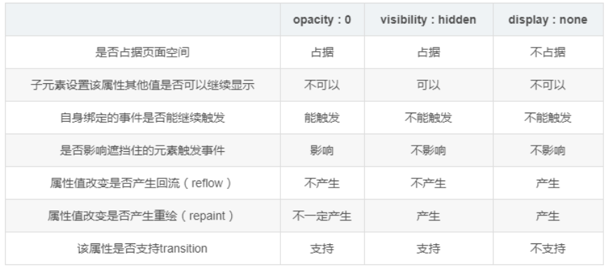

# 1、display: none

（1）、浏览器不会生成属性为display: none;的元素。

（2）、display: none;不占据空间，把元素隐藏起来，所以动态改变此属性时会引起重排（改变页面布局），可以理解成在页面中把该元素删除掉一样。

（3）、display: none;不会被子孙继承，但是其子孙是不会显示的，毕竟都一起被隐藏了。

（4）、transition无效。

# 2、visibility: hidden

（1）、元素会被隐藏，但是不会消失，依然占据空间，隐藏后不会改变html原有样式。

（2）、visibility: hidden会被子孙继承，子孙也可以通过显示的设置visibility: visible;来反隐藏。

（3）、visibility: hidden;不会触发该元素已经绑定的事件。

（4）、visibility: hidden;动态修改此属性会引起重绘。

（5）、transition无效。

# 3、opacity:0;filter：alpha(opacity=0-100;（考虑浏览器兼容性的问题，最好两个都写上）

（1）、opacity:0;filter：alpha(opacity=0-100;只是透明度为100%,元素隐藏，依然占据空间,隐藏后不会改变html原有样式。

（2）、opacity:0;filter：alpha(opacity=0-100;会被子元素继承,且子元素并不能通过opacity=1，进行反隐藏。

（3）、opacity:0;filter：alpha(opacity=0-100;的元素依然能触发已经绑定的事件。

（4）、transition有效。
