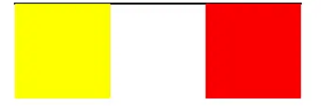
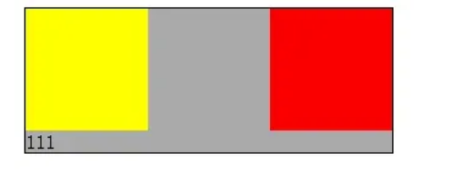

# 清除浮动

# 为什么要清除浮动呢？

```sh
<div class="container">
    <div class="left"></div>
    <div class="right"></div>
</div>
```

两个子div元素设置左右浮动，父容器没有设置高度，会造成父容器没有被撑开，这就是我们要清除浮动的原因。



# 清除浮动的几种方法

## 1 .clear{clear:both;}

在浮动元素后面添加 class 为 clear 的 空 div 元素，给这个 div 设置样式

```sh
<div class="container">
    <div class="left"></div>
    <div class="right"></div>
    <div class="clear"></div>
</div>
```
```
.clear{
      clear:both;
   }
```
## 2 

浮动元素后面右一个不为空的 div 元素，我们直接为这个元素添加 clear：both 样式

```
<div class="container">
    <div class="left"></div>
    <div class="right"></div>
    <div class="content">111</div>
</div>
```
```
.content{
      clear:both;
   }
```



## 3. 给父容器添加 overflow:hidden 或者 auto 样式


```
<div class="container">
    <div class="left"></div>
    <div class="right"></div>
</div>
```
```
  .container{
         width: 300px;
        border: 1px solid #000;
        background-color: #aaa;
        overflow:hidden;
        zoom:1;   /*IE6*/
    }
```

## 4 给父容器添加 clearfix 的 class ，用 伪元素 clearfix：after 来设置样式，清除浮动

```
<div class="container clearfix">
    <div class="left"></div>
    <div class="right"></div>
</div>
```
```
    .clearfix{
        zoom: 1;                     /*IE6*/
    }
    .clearfix:after{
        content: ".";
        height: 0;
        clear: both;
        display: block;
        visibility: hidden;
    }
```
