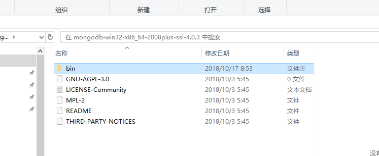
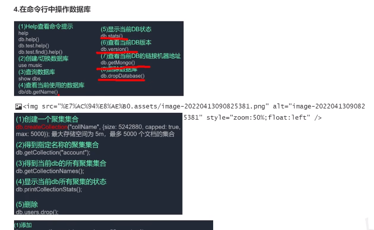
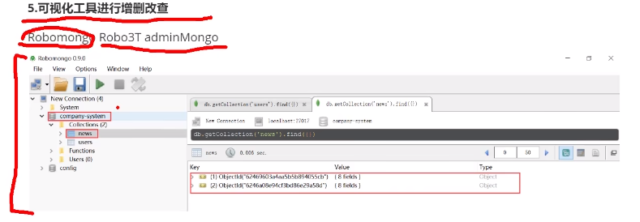
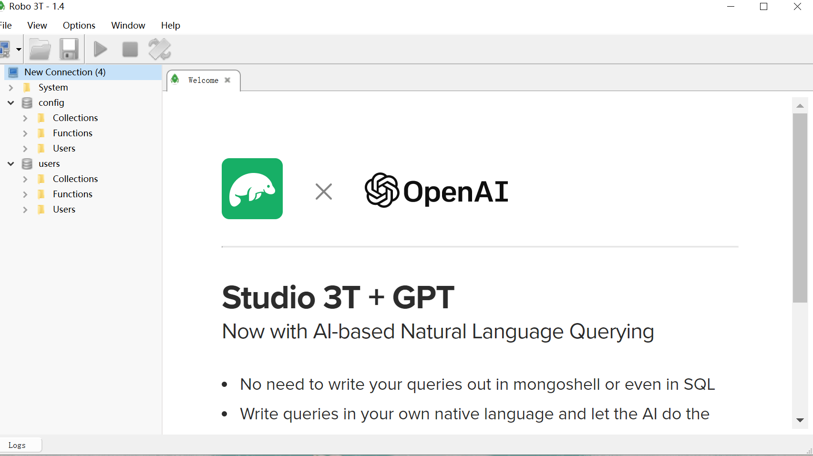
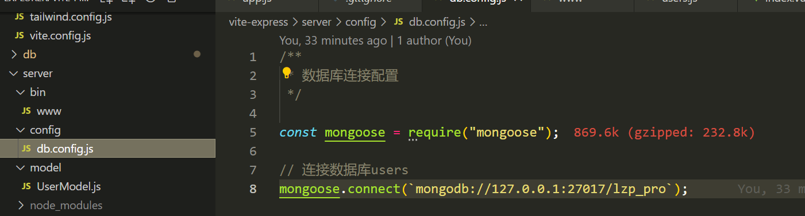
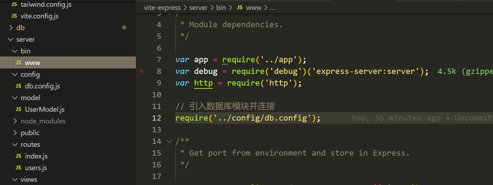
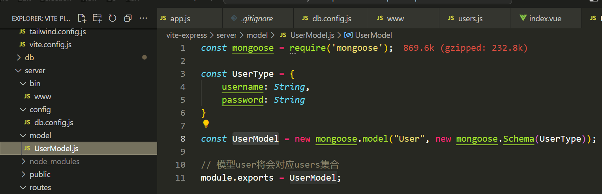
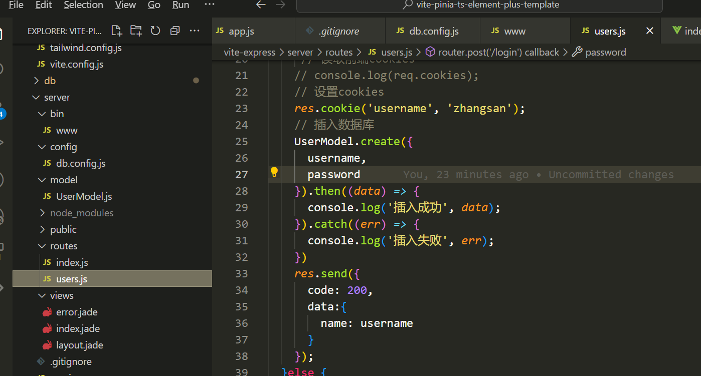

# mongodb 数据库

## 一 、下载
下载绿色免安装版本（也可以官方版本）

# 安装


## 二、解压（免安装版本安装方法）
1. 将安装的压缩文件解压
2. 文件目录如下所示


3.对应的bin目录文件结构如下


## 三、创建数据目录
1. mkdir -p /db
2. 在对应的目录下创建data文件夹（不包含中文路径）


# 四、启动服务端

下载数据库压缩包，解压文件夹后，进入bin目录，打开命令启动窗口，输入以下命令启动mongodb服务：
```bash
.\mongod.exe 第三步所创建的文件目录路径
```
如下图所示：


# 五、启动客户端

重新打开另一个命令启动窗口，在命令行输入以下命令启动mongodb客户端：
```bash
.\mongo.exe
```
如下图所示：


通过命令行进行相关操作


# 六、可视化工具



# 七、node 连接数据库（本项目基于express）







