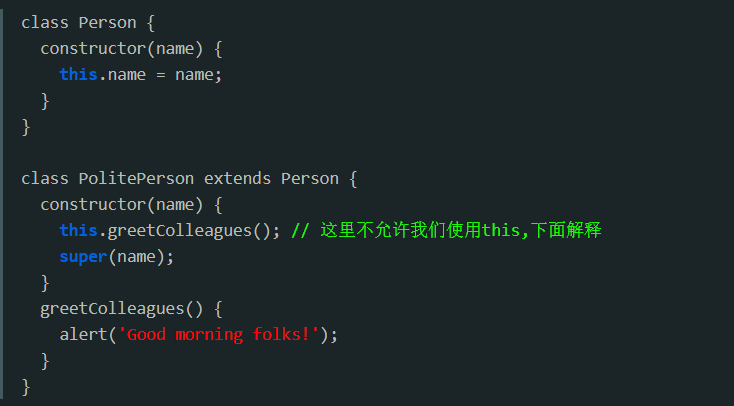
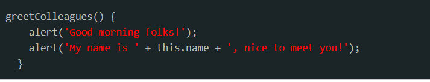

# es6的class继承为什么要调用super

原因：派生出的构造函数不会创造新的this对象，即子类没有自己的this；只有通过super()把基类（父类）创建好的this对象接下来，派生类才能像基类一样使用this来生成对象的属性。

一个子类 SubClass 继承父类 SuperClass 的构造器constructor时有两个要求：

1. 必须在构造器调用 super()。

2. this必须写在super()之后。

第一点是为了解决父类子类的歧义，确定了
“子类没有自己的 this”这一概念

子类和父类是个相对的概念，因为一个类可以既是子类也是父类，所以ES6里用的是绝对的概念：基类和派生类。而且这个概念是针对所有构造函数说的，JS 里的构造函数要么是基的，要么就是派生的。

ES6中,我们随手写的构造函数(function)都是基类，基类可以直接用this来指向调用它所在方法的对象。

咱自己给this总结了一句话：谁调用了this，this就指向谁。

ES6中的派生类，就是extend的class。派生出的构造函数不会创造新的this对象(或者说this指向的对象(这里可以回顾一下new关键字做的事情)，就是所说的"子类没有自己的this"。只有通过super()把基类创建好的this对象接下来，派生类才能像基类一样使用this来生成对象的属性。

那this为什么必须写在super( )之后

是为了避免一个代码陷阱。

上面的例子假设调用 super( )之前允许使用 this, 一段时间后为了满足一些需求，我们在 greetColleagues( ) 中添加：

但是我们忘了，this.greetColleagues( ) 在 super( )调用之前，this.name根本都没有定义，代码会抛错，像这样的代码可能很难想到什么时候发生。

因此，为了避免这个陷阱，JavaScript 强制要求在 constructor 中使用 this 之前，必须先调用 super。