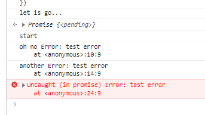

# promise的三种状态

Promise对象有三种状态，他们分别是：

1. pending: 等待中，或者进行中，表示还没有得到结果
2. resolved(Fulfilled): 已经完成，表示得到了我们想要的结果，可以继续往下执行
3. rejected: 也表示得到结果，但是由于结果并非我们所愿，因此拒绝执行 

特点：这三种状态不受外界影响，而且状态只能从pending改变为resolved或者rejected，并且不可逆

# 用法

```sh
const promise = new Promise(
  (resolve, reject) => {
    // ... some code
    if (/* 异步操作成功 */){
      resolve(value);
    } else {
      reject(error);
    }
  }
);

promise.then(
  (value) => { console.log(value) }, 
  (error) => { console.log(error) }
);
```

```sh
let promise = new Promise(function(resolve, reject) {
  console.log('Promise');
  resolve();
});

promise.then(function() {
  console.log('resolved.');
});

console.log('Hi!');

// Promise
// Hi!
// resolved
```

上面代码中，Promise 新建后立即执行，所以首先输出的是Promise。然后，then方法指定的回调函数，将在当前脚本所有同步任务执行完才会执行，所以resolved最后输出。

# Promise.prototype.catch()

Promise.prototype.catch() 方法是.then(null, rejection)或.then(undefined, rejection)的别名，用于指定发生错误时的回调函数。

```sh
getJSON('/posts.json')
  .then(function(posts) {
    // ...
  })
  .catch(function(error) {
    // 处理 getJSON 和 前一个回调函数运行时发生的错误
    console.log('发生错误！', error);
  });
```

上面代码中，getJSON()方法返回一个 Promise 对象，如果该对象状态变为resolved，则会调用then()方法指定的回调函数；如果异步操作抛出错误，状态就会变为rejected，就会调用catch()方法指定的回调函数，处理这个错误。另外，then()方法指定的回调函数，如果运行中抛出错误，也会被catch()方法捕获。

```sh
p
  .then((val) => console.log('fulfilled:', val))
  .catch((err) => console.log('rejected', err))

// 等同于
p
  .then((val) => console.log('fulfilled:', val))
  .then(null, (err) => console.log("rejected:", err));

```

下面是一个例子。

```sh
const promise = new Promise(function(resolve, reject) {
  throw new Error('test');
});
promise
  .catch(function(error) {
    console.log(error);
  });
// Error: test
```

上面代码中，promise抛出一个错误，就被catch()方法指定的回调函数捕获。注意，上面的写法与下面两种写法是等价的。

```sh
// 写法一
const promise = new Promise(function(resolve, reject) {
  try {
    throw new Error('test');
  } catch(e) {
    reject(e);
  }
});
promise
  .catch(function(error) {
    console.log(error);
  });


// 写法二
const promise = new Promise(function(resolve, reject) {
  reject(new Error('test'));
});

promise
  .catch(function(error) {
    console.log(error);
  });
```

比较上面两种写法，可以发现reject()方法的作用，等同于抛出错误。

如果 Promise 状态已经变成resolved，再抛出错误是无效的。

```sh
const promise = new Promise(function(resolve, reject) {
  resolve('ok');
  throw new Error('test');
});
promise
  .then(function(value) { console.log(value) })
  .catch(function(error) { console.log(error) });
// ok
```
上面代码中，Promise 在resolve语句后面，再抛出错误，不会被捕获，等于没有抛出。因为 Promise 的状态一旦改变，就永久保持该状态，不会再变了。


Promise 对象的错误具有“冒泡”性质，会一直向后传递，直到被捕获为止。也就是说，错误总是会被下一个catch语句捕获。

```sh
getJSON('/post/1.json')
  .then(function(post) {
    return getJSON(post.commentURL);
  })
  .then(function(comments) {
    // some code
  })
  .catch(function(error) {
    // 处理前面三个Promise产生的错误
  });
```
上面代码中，一共有三个 Promise 对象：一个由getJSON()产生，两个由then()产生。它们之中任何一个抛出的错误，都会被最后一个catch()捕获。

一般来说，不要在then()方法里面定义 Reject 状态的回调函数（即then的第二个参数），总是使用catch方法。
```sh
// bad
promise
  .then(function(data) {
    // success
  }, function(err) {
    // error
  });


// good
promise
  .then(function(data) { //cb
    // success
  })
  .catch(function(err) {
    // error
  });
```
上面代码中，第二种写法要好于第一种写法，理由是第二种写法可以捕获前面then方法执行中的错误，也更接近同步的写法（try/catch）。因此，建议总是使用catch()方法，而不使用then()方法的第二个参数。

跟传统的try/catch代码块不同的是，如果没有使用catch()方法指定错误处理的回调函数，Promise 对象抛出的错误不会传递到外层代码，即不会有任何反应。

```sh
const someAsyncThing = function() {
  return new Promise(function(resolve, reject) {
    // 下面一行会报错，因为x没有声明
    resolve(x + 2);
  });
};

someAsyncThing()
  .then(function() {
    console.log('everything is great');
  });

setTimeout(() => { console.log(123) }, 2000);

// Uncaught (in promise) ReferenceError: x is not defined
// 123
```
上面代码中，someAsyncThing()函数产生的 Promise 对象，内部有语法错误。浏览器运行到这一行，会打印出错误提示ReferenceError: x is not defined，但是不会退出进程、终止脚本执行，2 秒之后还是会输出123。这就是说，Promise 内部的错误不会影响到 Promise 外部的代码，通俗的说法就是“Promise 会吃掉错误”。

一般总是建议，Promise 对象后面要跟catch()方法，这样可以处理 Promise 内部发生的错误。catch()方法返回的还是一个 Promise 对象，因此后面还可以接着调用then()方法。

```sh
const someAsyncThing = function() {
  return new Promise(function(resolve, reject) {
    // 下面一行会报错，因为x没有声明
    resolve(x + 2);
  });
};

someAsyncThing()
  .catch(function(error) {
    console.log('oh no', error);
  })
  .then(function() {
    console.log('carry on');
  });

// oh no [ReferenceError: x is not defined]
// carry on
```

上面代码运行完catch()方法指定的回调函数，会接着运行后面那个then()方法指定的回调函数。如果没有报错，则会跳过catch()方法。


```sh
Promise.resolve()
  .catch(function(error) {
    console.log('oh no', error);
  })
  .then(function() {
    console.log('carry on');
  });

// carry on


```
上面的代码因为没有报错，跳过了catch()方法，直接执行后面的then()方法。此时，要是then()方法里面报错，就与前面的catch()无关了。

catch()方法之中，还能再抛出错误。

```sh
const someAsyncThing = function() {
  return new Promise(function(resolve, reject) {
    // 下面一行会报错，因为x没有声明
    resolve(x + 2);
  });
};

someAsyncThing()
  .then(function() {
    return someOtherAsyncThing();
  })
  .catch(function(error) {
    console.log('oh no', error);
    // 下面一行会报错，因为 y 没有声明
    y + 2;
  })
  .then(function() {
    console.log('carry on');
  });

// oh no [ReferenceError: x is not defined]
```

上面代码中，catch()方法抛出一个错误，因为后面没有别的catch()方法了，导致这个错误不会被捕获，也不会传递到外层。如果改写一下，结果就不一样了。

```sh
someAsyncThing()
  .then(function() {
    return someOtherAsyncThing();
  })
  .catch(function(error) {
    console.log('oh no', error);
    // 下面一行会报错，因为y没有声明
    y + 2;
  })
  .catch(function(error) {
    console.log('carry on', error);
  });
// oh no [ReferenceError: x is not defined]
// carry on [ReferenceError: y is not defined]
```

上面代码中，第二个catch()方法用来捕获前一个catch()方法抛出的错误。

```sh
console.log('let is go...')

const promise = new Promise( resolve => {
  setTimeout(()=>{
    resolve()
  }, 2000)
})
promise
  .then(() => {
    console.log('start')
    throw new Error('test error')
  })
  .catch((error) => {
    console.log('oh no', error);
    throw new Error('test error')
  })
  .then(function() {
    console.log('carry on');
  })
  .then(function() {
    console.log('and one');
  })
  .catch((error) => {
    console.log('another', error);
    throw new Error('test error')
  })
```



由于第一个catch抛出错误变为reject状态，所以直接跳过后面的两个then执行最后的catch捕获异常

# Promise.all()

Promise.all([p1, p2, p3])用于将多个promise实例，包装成一个新的Promise实例，返回的实例就是普通的promise。

它接收一个数组作为参数
数组里可以是Promise对象，也可以是别的值，只有Promise会等待状态改变
当所有的子Promise都完成，该Promise完成，返回值是全部值得数组
有任何一个失败，该Promise失败，返回值是第一个失败的子Promise结果


# Promise.race()

接收一个数组作为参数，它有任意一个完成就算完成

```sh
let p1 = new Promise(resolve => {
  setTimeout(() => {
      resolve('I\`m p1 ')
  }, 1000)
});

let p2 = new Promise(resolve => {
  setTimeout(() => {
      resolve('I\`m p2 ')
  }, 2000)
});

Promise.race([p1, p2])
  .then(value => {
      console.log(value)
  })
```

异步操作和定时器放在一起，，如果定时器先触发，就认为超时，告知用户；
例如我们要从远程的服务家在资源如果5000ms还没有加载过来我们就告知用户加载失败