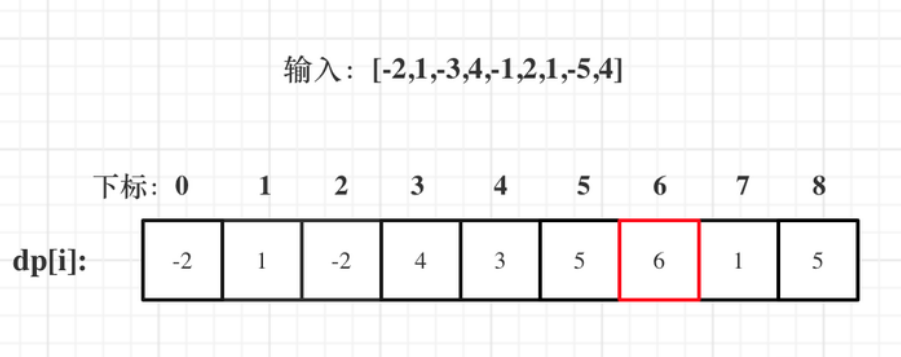

# 动规五部曲如下：

## 确定dp数组（dp table）以及下标的含义
dp[i]：包括下标i之前的最大连续子序列和为dp[i]。

## 确定递推公式
dp[i]只有两个方向可以推出来：

dp[i - 1] + nums[i]，即：nums[i]加入当前连续子序列和
nums[i]，即：从头开始计算当前连续子序列和
一定是取最大的，所以dp[i] = max(dp[i - 1] + nums[i], nums[i]);

## dp数组如何初始化
从递推公式可以看出来dp[i]是依赖于dp[i - 1]的状态，dp[0]就是递推公式的基础。

dp[0]应该是多少呢?

更具dp[i]的定义，很明显dp[0]因为为nums[0]即dp[0] = nums[0]。

## 确定遍历顺序
递推公式中dp[i]依赖于dp[i - 1]的状态，需要从前向后遍历。

举例推导dp数组
以示例一为例，输入：nums = [-2,1,-3,4,-1,2,1,-5,4]，对应的dp状态如下：

```sh
var maxSubArray = function(nums) {
    if(!nums.length){
        return 0
    }
    let dp = new Array(nums.length)
    dp[0] = nums[0]
    let res = dp[0]
    for(let i = 1; i < nums.length; i++){
        dp[i] = Math.max(dp[i-1] + nums[i], nums[i])
        res = Math.max(dp[i], res)
    }
    return res
};
```

