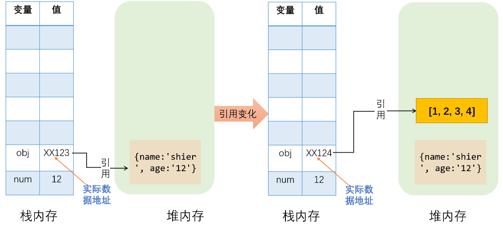
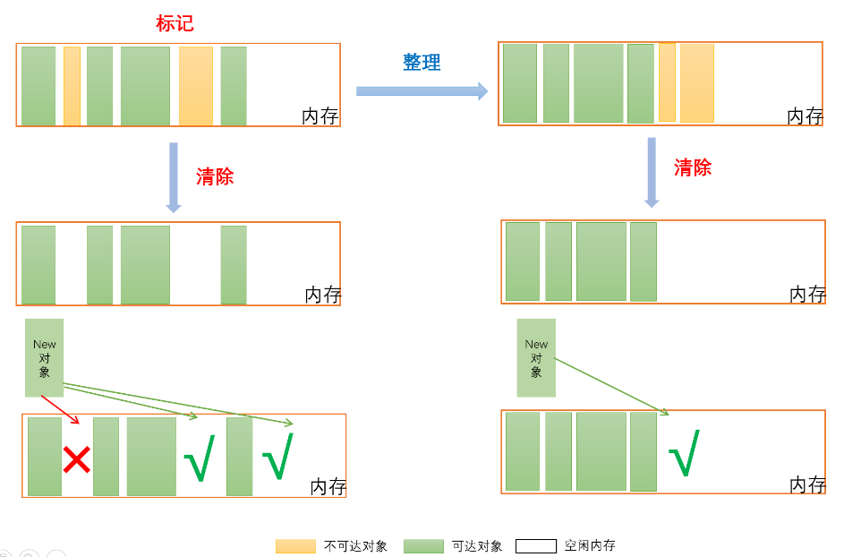
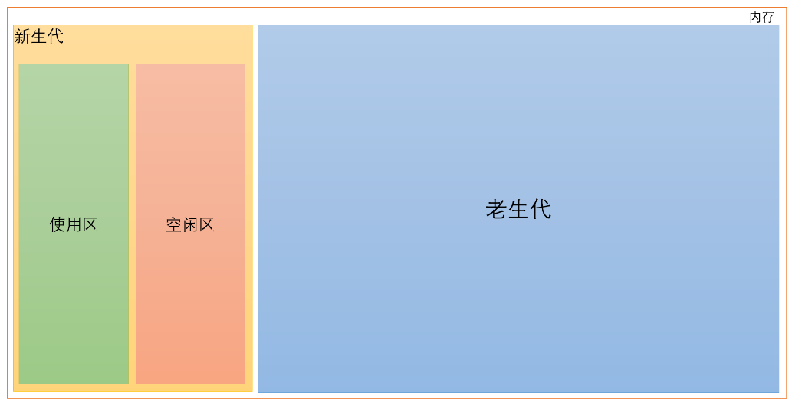

# JavaScript-垃圾回收机制

## 一、程序中的垃圾
在程序中，就是当一个变量没有被其他变量或属性引用的时候，该变量就是程序中的垃圾了。那变量又分局部变量和全局变量，它们的生命周期是不同的，释放内存（垃圾回收）的判断也是不同的

## 二、变量生命周期

1. 全局变量：

描述：定义在所有函数之外的变量。
生命周期：会持续到浏览器关闭页面

2. 局部变量：

描述：定义在某个函数中的变量
生命周期：函数执行过后就结束了，此时便可释放它们占用的内存（垃圾回收）

## 三、数据存储
在Javascript中，基本数据类型存储在栈内存中，引用数据类型存储在堆内存中，但是引用数据类型会在栈内存中存储一个实际对象的引用。



上图中所示粉色块内数据没有被引用变成了垃圾。

## 四、垃圾回收的两种常用方法

了解了以上基础知识后，再来看一下垃圾回收究竟是何物？

垃圾回收并不是实时的，因为开销比较大，所以垃圾回收器会周期性的释放程序中已经不在被引用的垃圾对象。那如何判断哪些被引用了，哪些不再被引用？通常会使用以下两种方法来进行判断。

1. 标记清除法

描述：垃圾回收器会标记所有在栈内存中引用的对象，然后释放所有未被标记的对象。

这是目前浏览器大多基于标记清除法。我们可以分为两个阶段：

标记：从根节点遍历为每个可以访问到的对象都打上一个标记，表示该对象可达。

清除：在没有可用分块时，对堆内存遍历，若没有被标记为可达对象就将其回收。

优点：实现简单。
缺点：a：内存过于碎片化；b：内存分配速度慢。

解决方法：标记-整理法
标记整理法和标记清除法标记阶段一致，只是整理阶段是先将被引用的对象移动到一端，然后清理掉标记的内存。
视图如下：



1. 引用计数法

描述：垃圾回收器会为每个对象添加一个引用计数器，每当有一个地方引用它时，计数器值就+1；当引用失效时，计数器值就-1；任何时刻计数器为0的对象就是不可能再被访问的。

优点：当引用数为0时会被立即回收
缺点：a：计数器的增减处理频繁，会导致空间的使用效率降低；b：循环引用无法收回，导致内存泄漏。

若有一函数Person中a引用了b，b引用了a。每次调用函数Person，它们的引用计数都不为0，则永远不能被回收。
示例如下：

```sh
function Person(){
	let a={};
	let b={};
	a.prop = b;
	b.prop = a;
}
```

## 五、分代式垃圾回收机制

把分代式垃圾回收机制单独拎出来是因为涉及内容较多，容易混淆。v8中将内存分成了两个区，新生代和老生代。新生代对象存活时间较短，内存通常支持1~8MB。而老生代存储存活时间较长或常驻内存的对象。对于新老两块内存区域的垃圾回收频率不同，所以V8 采用了两个垃圾回收器来管控。
视图如下:



1. 新生代垃圾回收

新生代垃圾回收通过Scavenge策略进行垃圾回收，在具体实现中，主要采用了一种复制式的方法Cheney算法。Cheney算法将堆内存也分为两个区，一个使用状态的空间我们称为使用区。一个处于闲置状态的空间称为空闲区。新加入的对象都会被存放到使用区，当使用区快被写满时，就执行一次垃圾回收操作。

（1）垃圾回收流程

a. 先对使用区中的活动做标记

b.标记完成后，将使用区的活动对象复制进空闲区并进行排序

c.将原先使用区对象占用的空间释放

d.最后进行角色互换，把空闲区变为使用区，使用区变为空闲区

（2）新生代对象何时会到老生代？

第一种情况：经过多次复制后依然存活的对象会被认为是生命周期较强的对象，会被移到老生代管理。

第二种情况：如果复制一个对象到空闲区时，空闲区空间占用超过25%，那么这个对象将被移到老生代区域。原因是，当完成Scavenge回收后，空闲区转变成使用区，需继续进行内存分配，若占比过大，将会影响后续内存的分配。

（3）并行回收

Javascript是一门单线程语言，它是运行在主线程上的，而在进行垃圾回收的时候就会阻塞Javascript脚本的执行，需等待垃圾回收完毕后再恢复脚本执行，这种行为叫全停顿。那当GC时间过长就会造成页面卡顿问题。那一个人干活慢，n个人一起速度便会是一个人的n倍。程序也一样，我们可以通过引入多个辅助线程来同时处理。因此V8引入了并行回收机制。
新生代对象空间就采用并行策略。在垃圾回收过程中，启动多个线程来负责新生代中的垃圾清理，这些线程同时将对象空间中的数据移到空闲区。由于这个过程中数据地址会发生改变，所以还需要同步更新引用这些对象的指针。

2. 老生代垃圾回收

老生代数据大多是存活的对象，不需要时常清除更新，所以采用上面提到的标记清除法来进行垃圾回收。因为上面也提到标记清除后会产生大量内存碎片，所以V8就采用了上文所说的标记整理法来解决这个问题。

（1）增量标记
并行策略虽然可以增加垃圾回收的效率，对于新生代这样存放较小对象的回收器能有很好的优化，但其实还是全停顿式的。对于存放较大对象的老生代来说，这些较大对象GC时哪怕使用并行策略依旧会消耗大量时间。所以V8对老生代进行了优化，从全停顿标记切换到了增量标记。

增量标记：就是将一次GC分成多步小GC标记，让JS和小GC标记交替执行，直到标记完成。
问题来了，小GC标记执行完后是如何暂停执行JS任务，而后又是如何进行下一次小GC 标记？如果执行JS任务时刚被标记好的对象引用又被修改了该当如何？V8解决这两个问题的方法分别是三色标记法和写屏障。

1）解决问题一：三色标记法

标记清理法区分是通过非黑即白的策略，但这样便会出现在增量标记时，内存中黑白都有，我们无法区分下一步是什么？所以采用了三色标记法，使用每个对象的两个标记位和一个标记工作表来实现标记，两个标记位编码三种颜色：黑（11），白（00），灰（10）。

a.黑色表示对象自身及对象的引用都被标记（已检查状态）

b.白色表示未被标记的对象（初始状态）

c.灰色表示自身被标记，自身的引用未被标记（待检查状态）

执行流程如下：

a. 初始将所有对象都是白色

b.从root对象开始，先将root对象标记为灰色并推入标记工作表中

c.当收集器从标记工作表中弹出对象并访问他的所有引用对象时，自身灰色就会变成黑色。

d.将自身的下一个引用对象标记为灰色

一直这样执行下去，直到没有可以被标记为灰色的对象时，剩下的白色对象都是不可达的，进入清理阶段。恢复时从灰色标记对象开始执行。

2）解决问题二：写屏障

为了解决黑色对象在程序执行中被新添加引用或已经标记黑色的被引用对象不再被引用了。写屏障就有了以下两个变化：

a. 不对已标记的黑色对象做处理，因为在之后的GC中也会被清理。

b. Write-barrier 机制强制不变黑的对象指向白色对象。这个也被称作强三色不变性。所以一旦有黑色对象引用白色对象，该机制会强制将引用的白色对象改为灰色，从而保证下一次增量 GC 标记阶段可以正确标记。

（2）懒性清理

增量标记完后，如果当前内存足以支持代码的快速运行，也没必要立即清理，可让程序先运行，也无需一次性清理完所有垃圾对象，可以按需清理直到所有垃圾对象清理完后再继续增量标记。

### 并发回收
并发主要发生在工作线程上。当在工作线程（辅助线程）执行GC是，应用程序可以继续在主线程运行并不会被挂起。
这也是有问题的，因为GC也在进行，应用程序也在执行，此时对象的引用关系随时都有可能变化，所以之前做的一些标记就需要改变，所以需要读写锁机制来控制这一点。
