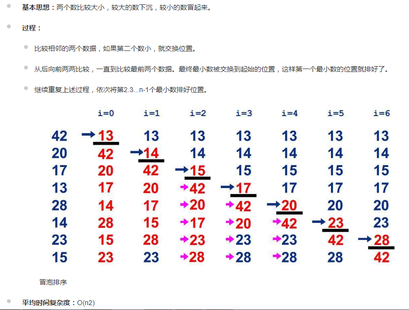

# 冒泡排序



```sh
let temp=0;
for(let i=0; i<arr.length; i++){
    for(let j=i+1; j<arr.length; j++){
        if(arr[i]>arr[j]){
            temp=arr[i];
            arr[i]=arr[j];
            arr[j]=temp;
         // [ arr[i], arr[j] ] =[ arr[j], arr[i] ] 
        };
    }
}
```
