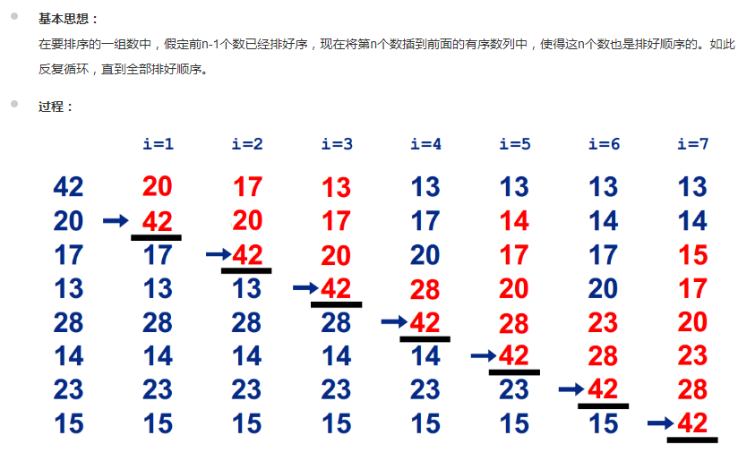

# 插入排序



```sh
function insertSort(arr){
    // let temp=0;
    for(let i=0; i<arr.length-1; i++){
        for(let j=i+1; j>0; j--){
            if(arr[j]<arr[j-1]){
                [ arr[j], arr[j-1] ] = [ arr[j-1], arr[j] ]
            }else{
                break;
            }
        }
    };		
}
var arr=[10,0,4,9,22,11,27,7];
insertSort(arr)
console.log(arr);
```