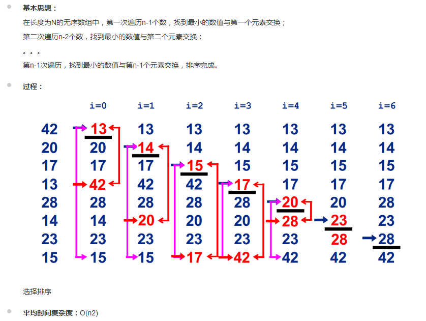

# 选择排序



```sh
function selectSort(arr){
    // 核心思想：
    // 第一次遍历n-1个数，找到最小的数值与第一个元素交换，
    // 第二次遍历n-2个数，找到最小的数值与第二个元素交换，
    // 类推。。。
    for(let i=0; i<arr.length; i++){
        let minIndex=i;
        for(let j=i+1; j<arr.length; j++){
            if(arr[j]<arr[minIndex]){
                minIndex=j;
            }
        };
        if(minIndex!==i){
            [arr[minIndex], arr[i]] = [arr[i], arr[minIndex]];
        };
    };
}
var arr=[10,0,4,9,22,11,27,7];
selectSort(arr)
console.log(arr);
```
