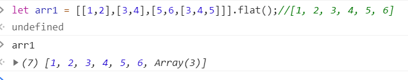
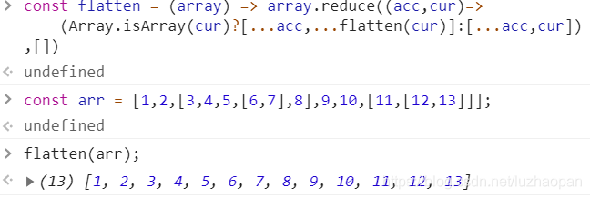
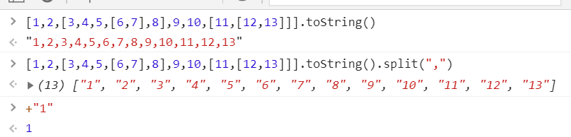

# 数组扁平化

​
## 二维数组时，可以简单使用flat()方法

```sh
let arr = [[1,2],[3,4],[5,6]].flat();
console.log(arr); // [1,2,3,4,5,6]
```

如果是多维数组，则flat()将达不到效果，



需要给flat()传一个参数，var newArray = arr.flat([depth])，
参数：depth ，可选，指定要提取嵌套数组的结构深度，默认值为 1。

```sh
let arr = [[1,2],[3,4],[5,6]].flat(Infinity);
console.log(arr); // [1,2,3,4,5,6]
```

## 迭代实现 （ES6扩展运算符...）

```sh
const arr = [1,2,[3,4,5,[6,7],8],9,10,[11,[12,13]]];
const flatten = (arr) => {
    while(arr.some(item=>Array.isArray(item))){
        arr=[].concat(...arr);
    }
    return arr;
}

console.log(flatten(arr)); // [1, 2, 3, 4, 5, 6, 7, 8, 9, 10, 11, 12, 13]
```


## 普通递归实现

```sh
const arr = [1,2,[3,4,5,[6,7],8],9,10,[11,[12,13]]];

const flatten = (arr) => {
  let result = [];
  arr.forEach((item, i, arr) => {
    if (Array.isArray(item)) {
      result = result.concat(flatten(item));
    } else {
      result.push(arr[i])
    }
  })
  return result;
};

console.log(flatten(arr));
```


## 高级递归（reduce方法）

```sh
const flatten = (array) => array.reduce((acc,cur)=>
    (Array.isArray(cur)?[...acc,...flatten(cur)]:[...acc,cur]),[])
```




## toString()

该方法利用了 toString 把数组变成以逗号分隔的字符串，然后可通过遍历数组把每一项再变回原来的类型。
​

```sh
const arr = [1,2,[3,4,5,[6,7],8],9,10,[11,[12,13]]];

const flatten = (arr) => arr.toString().split(',').map((item) => +item);

console.log(flatten(arr));
```


## [].concat.apply

```sh
const arr = [1,2,[3,4,5,[6,7],8],9,10,[11,[12,13]]];

const flatten = (arr) => {
  while (arr.some(item => Array.isArray(item))){
    arr = [].concat.apply([], arr);
  }
  return arr;
}

console.log(flatten(arr));
```


​