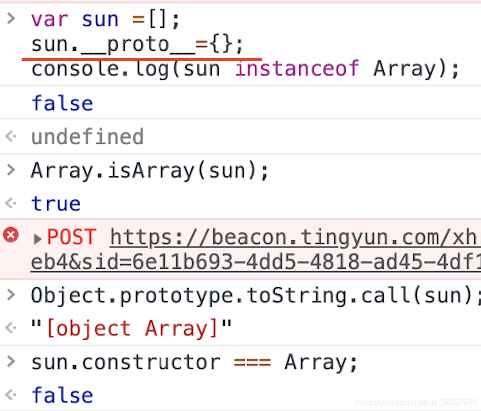

# 深浅拷贝

# 只对第一层级做拷贝

## 深拷贝数组（只拷贝第一级数组元素）　

### 直接遍历

```sh
var array = [1, 2, 3, 4];
function copy (array) {
   let newArray = []
   for(let item of array) {
      newArray.push(item);
   }
   return  newArray;
}
var copyArray = copy(array);
copyArray[0] = 100;
console.log(array); // [1, 2, 3, 4]
console.log(copyArray); // [100, 2, 3, 4]
```
### slice()

```sh
var array = [1, 2, 3, 4];
var copyArray = array.slice();
copyArray[0] = 100;
console.log(array); // [1, 2, 3, 4]
console.log(copyArray); // [100, 2, 3, 4]
```
slice() 方法返回一个从已有的数组中截取一部分元素片段组成的新数组（不改变原来的数组！）

用法：array.slice(start,end) start表示是起始元素的下标，end表示的是终止元素的下标
当slice()不带任何参数的时候，默认返回一个长度和原数组相同的新数组

### concat()

```sh
var array = [1, 2, 3, 4];
var copyArray = array.concat();
copyArray[0] = 100;
console.log(array); // [1, 2, 3, 4]
console.log(copyArray); // [100, 2, 3, 4]
```
concat() 方法用于连接两个或多个数组。( 该方法不会改变现有的数组，而仅仅会返回被连接数组的一个副本。)

用法：array.concat(array1,array2,......,arrayN)

因为我们上面调用concat的时候没有带上参数，所以var copyArray = array.concat();实际上相当于var copyArray = array.concat([]);也即把返回数组和一个空数组合并后返回

#### 注意：
但是，事情当然不会这么简单，我上面的标题是 “深拷贝数组（只拷贝第一级数组元素）”，这里说的意思是对于一级数组元素是基本类型变量（如number,String,boolean）的简单数组, 上面这三种拷贝方式都能成功，但对第一级数组元素是对象或者数组等引用类型变量的数组，上面的三种方式都将失效，例如：
```sh
var array = [
  { number: 1 },
  { number: 2 },
  { number: 3 }
];
var copyArray = array.slice();
copyArray[0].number = 100;
console.log(array); //  [{number: 100}, { number: 2 }, { number: 3 }]
console.log(copyArray); // [{number: 100}, { number: 2 }, { number: 3 }]
```

## 深拷贝对象

### 直接遍历

```sh
var obj = {
  name: '彭湖湾',
  job: '学生'
}
 
function copy (obj) {
   let newObj = {};
     for (let item in obj ){
       newObj[item] = obj
     }
     return newObj;
}
 var copyObj = copy(obj);
copyObj.name = '我才不是彭湖湾呢！ 哼 (。・`ω´・)';
console.log(obj); // {name: "彭湖湾", job: "学生"}
console.log(copyObj); // {name: "我才不是彭湖湾呢！ 哼 (。・`ω´・)", job: Object}
```
### ES6 Object.assign

```sh
var obj = {
  name: '彭湖湾',
  job: '学生'
}
var copyObj = Object.assign({}, obj);
copyObj.name = '我才不叫彭湖湾呢！ 哼  (。・`ω´・)';
console.log(obj);   // {name: "彭湖湾", job: "学生"}
console.log(copyObj);  // {name: "我才不叫彭湖湾呢！ 哼  (。・`ω´・)", job: "学生"}
```

Object.assign：用于对象的合并，将源对象（source）的所有可枚举属性，复制到目标对象（target），并返回合并后的target

用法： Object.assign(target, source1, source2);  

所以 copyObj = Object.assign({}, obj);  这段代码将会把obj中的一级属性都拷贝到 ｛｝中，然后将其返回赋给copyObj


### ES6扩展运算符
```sh
var obj = {
    name: '彭湖湾',
    job: '学生'
}
var copyObj = { ...obj }
copyObj.name = '我才不叫彭湖湾呢！ 哼  (。・`ω´・)'
console.log(obj.name) //   彭湖湾
console.log(copyObj.name)  // 我才不叫彭湖湾呢！ 哼  (。・`ω´・)
```
扩展运算符（...）用于取出参数对象的所有可遍历属性，拷贝到当前对象之中

#### ⚠️注意：
实际上，无论是使用扩展运算符(...)还是解构赋值，对于引用类型都是浅拷贝。所以在使用slice()、concat()、...对数组拷贝时，只有当数组内部属性值不是引用类型是，才能实现深拷贝。对多层嵌套对象，上面三种方法都会失败：

```sh
var obj = {
   name: {
      firstName: '彭',
      lastName: '湖湾'
   },
   job: '学生'
}
var copyObj = Object.assign({}, obj)
copyObj.name.lastName = '湖水的小浅湾';
console.log(obj.name.lastName); // 湖水的小浅湾
console.log(copyObj.name.lastName); // 湖水的小浅湾
```

## 拷贝所有层级

有没有更强大一些的解决方案呢？使得我们能够
1. 不仅拷贝第一层级，还能够拷贝数组或对象所有层级的各项值
2. 不是单独针对数组或对象，而是能够通用于数组，对象和其他复杂的JSON形式的对象
   
请看下面：
下面这一招可谓是“一招鲜，吃遍天”
### JSON.parse(JSON.stringify(XXXX))

```sh
var array = [
    { number: 1 },
    { number: 2 },
    { number: 3 }
];
var copyArray = JSON.parse(JSON.stringify(array))
copyArray[0].number = 100;
console.log(array); //  [{number: 1}, { number: 2 }, { number: 3 }]
console.log(copyArray); // [{number: 100}, { number: 2 }, { number: 3 }]
```

JSON.parse() 方法用于将一个 JSON 字符串转换为对象--（反序列化）
JSON.stringify() 方法是将一个JavaScript值(对象或者数组)转换为一个 JSON字符串--(序列化）
序列化的缺点：

1). 不支持基本数据类型的undefined，序列化后将其省略

2). 不支持函数

3). NaN, Infinity序列化的结果是null

### 自己手动实现递归

```sh
let array = [
   { number: 1 },
   { number: 2 },
   { number: 3 }
];
function copy (obj) {
    //首先判断需要拷贝的“东西”是什么类型
    if(typeof obj !== 'object' || obj == null){
        return;
    }
    let newobj = obj.constructor === Array ? [] : {};
    //obj是数组类型，下面的i就是index；obj是对象，i就是key
    for(let i in obj){
        newobj[i] = typeof obj[i] === 'object' ? copy(obj[i]) : obj[i];
    }
    return newobj
}
 
let copyArray = copy(array)
copyArray[0].number = 100;
console.log(array); //  [{number: 1}, { number: 2 }, { number: 3 }]
console.log(copyArray); // [{number: 100}, { number: 2 }, { number: 3 }]
```

#### 【注意】
上文的所有的示例都忽略了一些特殊的情况： 

对对象/数组中的Function，正则表达式等特殊类型的拷贝
上述代码中还隐藏这两个知识点：

##### obj == null 为何不是 obj === null?
obj==null =>obj为null 或者 obj 为undefined，因为null == undefined,这样写能默认处理两种情况，obj===null ，成立前提只有obj是null

##### 怎样判断一个对象是不是数组？

先上方法（确定的方法有两种）

(1). 根据对象的class属性来判断，跨原型链调用toString()方法。  Object. prototype.toString.call(obj)===[ object Array]

(2). Array.isArray直接判断  Array. isArray(obj)。

###### 补充：
推荐文章：[为什么用Object.prototype.toString.call(obj)检测对象类型](https://www.cnblogs.com/youhong/p/6209054.html)

```sh
let arr=[1,2,3];
console.log(Array.prototype.hasOwnProperty("toString"));//true
console.log(arr.toString());//1,2,3 arr作为对象Object的实例，重写了toString()方法。

delete Array.prototype.toString;//delete操作符可以删除实例属性
console.log(Array.prototype.hasOwnProperty("toString"));//false
console.log(arr.toString());//"[object Array]" 
```

// 由于删除了实例对象中的toString()方法，找不到，顺着原型链往上走，就调用了对象Object的方法，返回的结果就和Array.prototype.toString(arr）一样的。

根据构造函数来判断 instanceof 操作符可以来表示实例是否属于某个构造函数创建的。
这种方法有一个问题，就是验证不够严格。 即使对象创建时不是使用数组创建的，但是只要原型链上有数组类型，也认为是数组,亦或者，即便创建时是数组创建，但其原型上有对象类型，便不再被认为是数组。



##### for...in 和for...of，forEach的区别，for...in用于对象复制时需要注意什么？

###### for... in特点

1. 遍历对象返回的对象的key值,遍历数组返回的数组的下标(key)。
2. for ... in 会遍历原型上的属性值
3. 遍历返回数据是乱序

总结一句:  for in 循环特别适合遍历对象。

###### for... of特点

1. for of遍历的只是数组内的元素，而不包括数组的原型属性method和索引name
2. for ... in 会遍历原型上的属性值
3. 遍历返回数据是乱序
4. for of 不同于 forEach, 它可以与 break、continue和return 配合使用,也就是说 for of 循环可以随时退出循环。

总结一句:  for of 比较适合遍历数组，及其他具有遍历器的集合

###### forEach特点
1. 使用forEach遍历数组的话，使用break不能中断循环，使用return也不能返回到外层函数。forEach与break和return 不搭
2. forEach()无法在所有元素都传递给调用的函数之前终止遍历

for…in循环可应用于对象的复制，不过其有一个缺点，就是会从原型属性里继承prototype()属性。 
例如： 
```sh
let array = [1,2,3,4,5] 
Array.prototype.age = 13；
var result = []; 
for（let i in array）{ 
    result.push(array[i]); 
} 
alert(result.join(“,”)); 
result返回结果【1,2,3,4,5,13】 
```

如何避免从原型属性里继承prototype()属性，这里使用hasOwnProperty(name)，该函数只是一个对象自身（不包括原型链）是否具有指定名称的属性。如果有返回true，如果没有返回false。 
```sh
let array = [1,2,3,4,5] 
Array.prototype.age = 13； 
var result = []; 
for（let i in array）{ 
if(array.hasOwnProperty(i)){ 
    result.push(array[i]); 
} 
alert(result.join(“,”)); 
} 
// result返回结果【1,2,3,4,5】
```

所以上面的深拷贝代码应优化为如下：

```
let array = [
   { number: 1 },
   { number: 2 },
   { number: 3 }
];
function copy (obj) {
    //首先判断需要拷贝的“东西”是什么类型
    if(typeof obj !== 'object' || obj == null) return;
    let newobj = Array.isArray(obj) ? [] : {};
    //obj是数组类型，下面的i就是index；obj是对象，i就是key
    for(let i in obj){
        if(obj.hasOwnProperty(i)){
            newobj[i] = typeof obj[i] === 'object' ? copy(obj[i]) : obj[i];
        }
    }
    return newobj
}
 
let copyArray = copy(array)
copyArray[0].number = 100;
console.log(array); //  [{number: 1}, { number: 2 }, { number: 3 }]
console.log(copyArray); // [{number: 100}, { number: 2 }, { number: 3 }]
```

## 存在大量深拷贝需求的代码——immutable提供的解决方案

实际上，即使我们知道了如何在各种情况下进行深拷贝，我们也仍然面临一些问题： 深拷贝实际上是很消耗性能的。（我们可能只是希望改变新数组里的其中一个元素的时候不影响原数组，但却被迫要把整个原数组都拷贝一遍，这不是一种浪费吗？）所以，当你的项目里有大量深拷贝需求的时候，性能就可能形成了一个制约的瓶颈了。
immutable的作用：

通过immutable引入的一套API，实现：

1. 在改变新的数组（对象）的时候，不改变原数组（对象）
2. 在大量深拷贝操作中显著地减少性能消耗

先睹为快：

```sh
const { Map } = require('immutable')
const map1 = Map({ a: 1, b: 2, c: 3 })
const map2 = map1.set('b', 50)
map1.get('b') // 2
map2.get('b') // 50
```