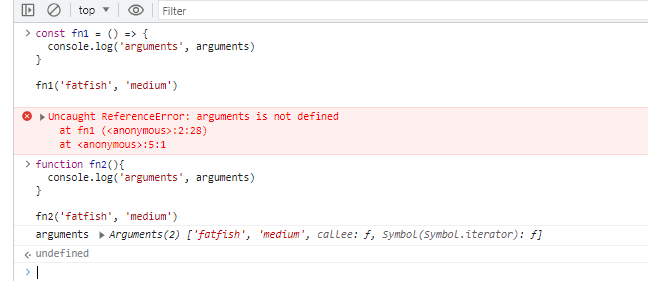
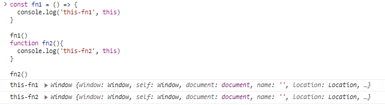
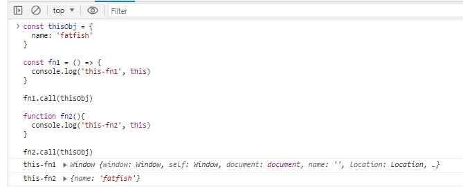
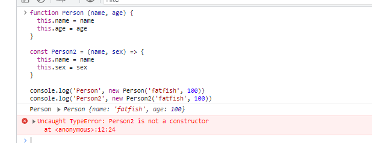
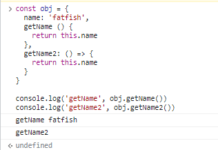
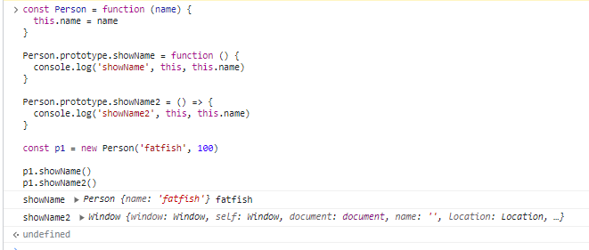

# 为什么箭头函数不能用new？

new关键字被用来创建一个实例。

new 在执行过程中，会进行以下4个操作

1. 创建一个空的简单JavaScript对象（即{}）；
2. 链接该对象（即设置该对象的构造函数）到另一个对象 ；
3. 将步骤1新创建的对象作为this的上下文 ；
4. 如果该函数没有返回对象，则返回this。

箭头函数本身没有this指向，所以 new 无法执行操作。

箭头函数不可以做构造函数，不能使用new 关键字，因为new关键字是调用函数对象的constructor属性，箭头函数中没有该属性，所以不能new

# 不支持参数对象

在箭头函数中，我们不能像在普通函数中那样使用 arguments 对象。

```sh
const fn1 = () => {
  console.log('arguments', arguments)
}

fn1('fatfish', 'medium')

function fn2(){
  console.log('arguments', arguments)
}

fn2('fatfish', 'medium')
```



我们如何才能在箭头函数中获取所有传递给函数的参数？

是的，没错，你可以使用扩展运算符(Spread Operator)来解决它。

```sh
const fn3 = (...values) => {
  console.log('values', values)
}

fn3('fatfish', 'medium')
```

# 无法通过apply、call、bind来改变this指针

我相信你可以很容易地知道下面的代码会输出什么。

```sh
const fn1 = () => {
  console.log('this-fn1', this)
}

fn1()
function fn2(){
  console.log('this-fn2', this)
}

fn2()
```



我们希望 fn1 和 fn2 都打印对象，我们应该怎么做？

```sh
const thisObj = {
  name: 'fatfish'
}

const fn1 = () => {
  console.log('this-fn1', this)
}

fn1.call(thisObj)

function fn2(){
  console.log('this-fn2', this)
}

fn2.call(thisObj)
```



因为箭头函数在定义的时候就决定了它的this指向谁，所以没有办法用fn1.call(thisObj)再次改变它。

# 什么时候不能使用箭头功能？

1. 请不要在构造函数中使用箭头函数

```sh
function Person (name, age) {
  this.name = name
  this.age = age
}

const Person2 = (name, sex) => {
  this.name = name
  this.sex = sex
}

console.log('Person', new Person('fatfish', 100))
console.log('Person2', new Person2('fatfish', 100))
```


为什么 new Person2 会抛出错误？

因为构造函数通过 new 关键字生成一个对象实例。生成对象实例的过程也是通过构造函数将this绑定到实例的过程。

但是箭头函数没有自己的this，所以不能作为构造函数使用，也不能通过new操作符调用。

2. 请不要在点击事件中操作this

我们经常在 click 事件中通过 this 读取元素本身。

```sh
const $body = document.body

$body.addEventListener('click', function () {
  // this and $body elements are equivalent
  this.innerHTML = 'fatfish'
})
```
但是如果你使用箭头函数给 DOM 元素添加回调，这将等同于全局对象窗口

```sh
const $body = document.body

$body.addEventListener('click', () => {
  this.innerHTML = 'fatfish'
})
```

3. 请不要在对象的方法中使用箭头函数

```sh
const obj = {
  name: 'fatfish',
  getName () {
    return this.name
  },
  getName2: () => {
    return this.name
  }
}

console.log('getName', obj.getName())
console.log('getName2', obj.getName2())
```


getName2方法不会打印“fatfish”，因为此时this和window是等价的，不等于obj

4. 请不要在原型链中使用箭头函数

```sh
const Person = function (name) {
  this.name = name
}

Person.prototype.showName = function () {
  console.log('showName', this, this.name)
}

Person.prototype.showName2 = () => {
  console.log('showName2', this, this.name)
}

const p1 = new Person('fatfish', 100)

p1.showName()
p1.showName2()
```

