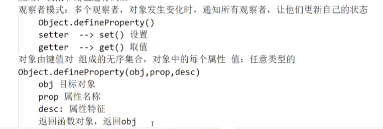
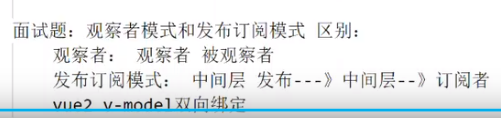

# 设计模式

## 一、单例模式

### 1.1 定义

单例模式（Singleton Pattern）是一种常用的软件设计模式，其核心思想是确保一个类只有一个实例，并提供一个全局访问点来获取该实例。

### 1.2 优点

1. **控制实例数量**：单例模式可以控制实例的数量，确保系统中只有一个实例存在，避免了资源浪费。
2. **全局访问点**：单例模式提供了一个全局访问点，使得其他对象可以通过这个访问点来获取唯一的实例，避免了直接创建实例带来的复杂性。
3. **延迟加载**：单例模式支持延迟加载，即在需要时才创建实例，这样可以提高系统的性能和响应速度。

### 1.3 缺点

1. **全局变量**：单例模式将实例作为全局变量，可能会导致代码的耦合度增加，不利于代码的测试和维护。
2. **扩展性差**：单例模式将实例作为全局变量，使得扩展性较差，如果需要修改实例的创建方式，需要修改全局代码。
3. **线程安全问题**：在多线程环境下，单例模式的实现需要考虑线程安全问题，否则可能会导致多个线程同时创建实例。

### 1.4 实现方式
1. **饿汉式**：在类加载时就创建实例，线程安全，但可能会导致资源浪费。
2. **懒汉式**：在需要时才创建实例，延迟加载，但需要考虑线程安全问题。
3. **双重检查锁定**：在懒汉式的基础上，通过双重检查锁定来确保线程安全。
4. **静态内部类**：通过静态内部类来实现懒汉式，线程安全且延迟加载。

### 1.5 应用场景
1. **配置管理**：单例模式可以用于配置管理，确保整个应用程序只有一个配置实例。
2. **数据库连接池**：单例模式可以用于数据库连接池，确保整个应用程序只有一个数据库连接池实例。
3. **日志管理**：单例模式可以用于日志管理，确保整个应用程序只有一个日志实例。
4. **缓存管理**：单例模式可以用于缓存管理，确保整个应用程序只有一个缓存实例。

### 1.6 代码示例
```javascript
// 饿汉式
class Singleton {
  static instance = new Singleton();
  constructor() {}
  static getInstance() {
    return this.instance;
  }
}

// 懒汉式
class Singleton {
  constructor() {}
  static instance = null;
  static getInstance() {
    if (!this.instance) {
      this.instance = new Singleton();
    }
    return this.instance;
  }
}

// 双重检查锁定
class Singleton {
  constructor() {}
  static instance = null;
  static getInstance() {
    if (!this.instance) {
      synchronized(Singleton.class) {
        if (!this.instance) {
          this.instance = new Singleton();
        }
      }
    }
    return this.instance;
  }
}

// 静态内部类
class Singleton {
  constructor() {}
  static getInstance() {
    return SingletonHolder.instance;
  }
  static class SingletonHolder {
    static instance = new Singleton();
  }
}
```

## 二、工厂模式

### 2.1 定义

工厂模式（Factory Pattern）是一种创建型设计模式，其核心思想是通过一个工厂类来创建对象，而不是直接使用 `new` 关键字来创建对象。工厂模式可以封装对象的创建过程，使得代码更加灵活和可维护。

### 2.2 优点
1. **封装对象创建过程**：工厂模式将对象的创建过程封装在一个工厂类中，使得代码更加清晰和易于维护。
2. **代码解耦**：工厂模式将对象的创建过程与使用过程解耦，使得代码更加灵活和可扩展。
3. **支持延迟加载**：工厂模式支持延迟加载，可以在需要时才创建对象，提高系统的性能和响应速度。

### 2.3 缺点
1. **增加代码复杂度**：工厂模式需要增加一个工厂类，可能会增加代码的复杂度。
2. **扩展性差**：如果需要增加新的对象类型，需要修改工厂类，可能会影响代码的可维护性。

### 2.4 实现方式
1. **简单工厂模式**：通过一个工厂类来创建对象，工厂类根据传入的参数来决定创建哪个对象。
2. **工厂方法模式**：通过定义一个工厂接口，然后由子类来实现具体的工厂方法，创建对象。
3. **抽象工厂模式**：通过定义一个工厂接口，然后由子类来实现具体的工厂方法，创建对象，并且可以创建一组相关的对象。

### 2.5 应用场景
1. **对象创建过程复杂**：当对象的创建过程比较复杂，需要封装时，可以使用工厂模式。
2. **需要延迟加载**：当需要延迟加载对象时，可以使用工厂模式。
3. **需要创建一组相关的对象**：当需要创建一组相关的对象时，可以使用工厂模式。

### 2.6 代码示例
```javascript
// 简单工厂模式
class Product {
  constructor() {}
  method() {}
}

class ConcreteProductA extends Product {
  constructor() {
    super();
  }
  method() {
    console.log('ConcreteProductA method');
  }
}

class ConcreteProductB extends Product {
  constructor() {
    super();
  }
  method() {
    console.log('ConcreteProductB method');
  }
}
class SimpleFactory {
  static createProduct(type) {
    switch (type) {
      case 'A':
        return new ConcreteProductA();
      case 'B':
        return new ConcreteProductB();
      default:
        return null;
    }
  }
}

// 工厂方法模式
class Product {
  constructor() {}
  method() {}
}

class ConcreteProductA extends Product {
  constructor() {
    super();
  }
  method() {
    console.log('ConcreteProductA method');
  }
}

class ConcreteProductB extends Product {
  constructor() {
    super();
  }
  method() {
    console.log('ConcreteProductB method');
  }
}

class Factory {
  createProduct() {
    return new Product();
  }
}

class ConcreteFactoryA extends Factory {
  createProduct() {
    return new ConcreteProductA();
  }
}

class ConcreteFactoryB extends Factory {
  createProduct() {
    return new ConcreteProductB();
}
}

// 抽象工厂模式
class AbstractFactory {
  createProductA() {}
  createProductB() {}
}

class ConcreteFactoryA extends AbstractFactory {
  createProductA() {
    return new ConcreteProductA();
  }
  createProductB() {
    return new ConcreteProductB();
  }
}

class ConcreteFactoryB extends AbstractFactory {
  createProductA() {
    return new ConcreteProductC();
  }
  createProductB() {
    return new ConcreteProductD();
  }
}
```

## 三、观察者模式
### 3.1 定义
观察者模式（Observer Pattern）是一种行为设计模式，它定义了对象之间的一对多依赖关系，当一个对象的状态发生改变时，所有依赖于它的对象都会得到通知并自动更新。

### 3.2 优点
1. **解耦**：观察者模式将观察者和被观察者解耦，使得它们可以独立地变化和扩展。
2. **支持广播**：观察者模式支持广播，可以同时通知多个观察者。

### 3.3 缺点
1. **增加复杂性**：观察者模式会增加系统的复杂性，因为需要维护观察者列表和通知机制。
2. **性能问题**：当观察者数量较多时，通知所有观察者可能会影响系统性能。

### 3.4 应用场景
1. **事件监听**：在事件驱动的编程中，可以使用观察者模式来实现事件监听。
2. **消息订阅**：在消息订阅模型中，可以使用观察者模式来实现消息的订阅和发布。
3. **数据绑定**：在数据绑定框架中，可以使用观察者模式来实现数据的双向绑定。

### 3.5 代码示例
```javascript
// 观察者模式
class Subject {
  constructor() {
    this.observers = [];
  }
  addObserver(observer) {
    this.observers.push(observer);
  }
  removeObserver(observer) {
    this.observers = this.observers.filter(o => o !== observer);
  }
  notify(data) {
    this.observers.forEach(observer => observer.update(data));
  }
}

class Observer {
  update(data) {
    console.log('Observer received data:', data);
  }
}

const subject = new Subject();
const observer1 = new Observer();
const observer2 = new Observer();

subject.addObserver(observer1);
subject.addObserver(observer2);

subject.notify('Hello, Observer Pattern!');
```



## 四、发布订阅模式
### 4.1 定义
发布订阅模式（Publish-Subscribe Pattern）是一种消息范式，它允许发送者（发布者）发布消息，而无需知道接收者（订阅者）的存在。接收者可以订阅感兴趣的主题，并在主题发生变化时接收通知。

### 4.2 优点
1. **解耦**：发布订阅模式将发布者和订阅者解耦，使得它们可以独立地变化和扩展。
2. **支持广播**：发布订阅模式支持广播，可以同时通知多个订阅者。

### 4.3 缺点
1. **增加复杂性**：发布订阅模式会增加系统的复杂性，因为需要维护订阅列表和通知机制。
2. **性能问题**：当订阅者数量较多时，通知所有订阅者可能会影响系统性能。

### 4.4 应用场景
1. **事件监听**：在事件驱动的编程中，可以使用发布订阅模式来实现事件监听。
2. **消息订阅**：在消息订阅模型中，可以使用发布订阅模式来实现消息的订阅和发布。
3. **数据绑定**：在数据绑定框架中，可以使用发布订阅模式来实现数据的双向绑定。

### 4.5 代码示例
```javascript
// 发布订阅模式
class EventEmitter {
  constructor() {
    this.events = {};
  }
  on(event, listener) {
    if (!this.events[event]) {
      this.events[event] = [];
    }
    this.events[event].push(listener);
  }
  off(event, listener) {
    if (!this.events[event]) return;
    this.events[event] = this.events[event].filter(l => l !== listener);
  }
  emit(event, data) {
    if (!this.events[event]) return;
    this.events[event].forEach(listener => listener(data));
  }
}

const emitter = new EventEmitter();

const listener1 = data => console.log('Listener 1 received data:', data);
const listener2 = data => console.log('Listener 2 received data:', data);

emitter.on('event1', listener1);
emitter.on('event1', listener2);

emitter.emit('event1', 'Hello, Publish-Subscribe Pattern!');
``` 

