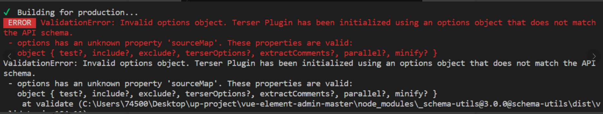

# 根据环境变量全局控制console.log的输出

开发环境下，为了方便调试，会有一些控制台的输出，但如果忘了删除或注释，打包到生产环境中，就会不太友好，容易产生歧义，以下通过几种方式来实现根据环境变量全局控制console.log的输出

## 方式一：全局定义

1. 全局定义定义函数（全局配置，生产环境取消 console.log 的控制台输出）

```sh
function consoleCancle(sign) {
    console.log = (function (oriLogFunc) {
        return function () {
            if (sign) {
                oriLogFunc.apply(this, arguments);
            }
        }
    })(console.log)
}
```

2. 根据不同环境设置
   
```sh
if (process.env.NODE_ENV === 'development') {  ## // 开发环境
    Vue.prototype.$baseUrl = "http://10.224.202.220:10006"
} else if (process.env.NODE_ENV === 'production') {  ## // 生产环境
    ## //判断配置文件是否开启日志调试功能， logDebug为true时输出; logDebug为False时不输出
    ## // 生产环境设置为false，控制台不打印日志
    Vue.prototype.$baseUrl = "http://110.24.202.10:10006"
    const logDebug = false;
    consoleCancle(logDebug)
} 
```

## 方式二：安装 terser - webpack - plugin

npm install terser - webpack - plugin - D

在vue.config.js文件里写插件的配置：

1. 直接修改webpack的配置

```sh
configureWebpack: config => {
    if (process.env.NODE_ENV === 'production') {
        ## // 为生产环境修改配置
        config.mode = 'production'
        ## // 生产环境下，console.log 控制台不输出
        config.optimization.minimizer[0].options.terserOptions.compress.drop_console = true
    } else {
        ##  // 为生产环境修改配置
        config.mode = 'development'
    }
    ## // 开发生产共同配置别名
    Object.assign(config.resolve, {
        alias: {
            '@': path.resolve(__dirname, './src')
        }
    })
}
```

2. vue官方文档里说也可以返回一个将会被合并的对象
```sh
configureWebpack: config => {
    if (process.env.NODE_ENV === 'production') {
        ## // 返回一个将会被合并的对象
        return {
            optimization: {
                minimizer: [
                    new TerserPlugin({
                        sourceMap: false,
                        terserOptions: {
                            compress: {
                                drop_console: true
                            }
                        }
                    })
                ]
            }
        }
    }
}
```

注意：该方式在打包的时候可能会出现以下报错



造成上面问题的原因是terser - webpack - plugin版本问题。

推荐使用terser - webpack - plugin@4.2.3，更新版本，重新打包即可。

## 方式三：安装 uglifyjs - webpack - plugin

npm install uglifyjs - webpack - plugin - D

在vue.config.js文件里写插件的配置：

```sh
const UglifyJsPlugin = require('uglifyjs-webpack-plugin')
```

```sh
configureWebpack: config => {
    if (process.env.NODE_ENV === 'production') {
        ## // 为生产环境修改配置
        config.plugins.push(
            ## // 添加代码压缩工具，及设置生产环境自动删除console
            new UglifyJsPlugin({
                uglifyOptions: {
                    compress: {
                        drop_debugger: true,
                        drop_console: true
                    }
                },
                sourceMap: false,
                parallel: true
            })
        )
    }
}
```

## 方式四：安装 babel - plugin - transform - remove - console

npm install babel - plugin - transform - remove - console - D

在babel.config.js文件里写插件的配置：

1. 方法一
   
```sh
const plugins = ['@vue/babel-plugin-transform-vue-jsx']
// 生产环境移除console
if (process.env.NODE_ENV === 'production') {
    plugins.push('transform-remove-console')
}
module.exports = {
    plugins: plugins,
    presets: ['@vue/cli-plugin-babel/preset']
}
```

1. 方法二

```sh
module.exports = {
    presets: ['@vue/cli-plugin-babel/preset'],
    env: {
        production: {
            plugins: ['transform-remove-console']
        },
        development: {
            plugins: ['dynamic-import-node']
        }
    }
}
```


