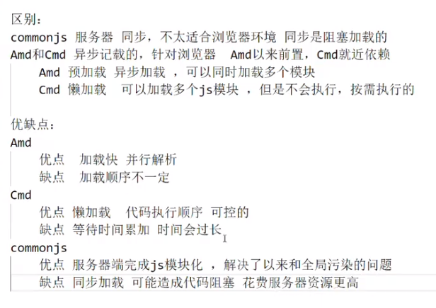

# 模块化-总结 AMD、CMD、CommonJS、UMD的区别

## 好处：

1. 提高了代码的复用性

2. 提高了代码的可维护性

3. 可以实现按需加载

## CommonJS
CommonJS是一种后端js规范，是nodeJs遵循的一种编写js模块的规范，

CommonJS加载模块是同步的，所以只有加载完成才能执行后面的操作。像Node.js主要用于服务器的编程，加载的模块文件一般都已经存在本地硬盘，所以加载起来比较快，不用考虑异步加载的方式，所以CommonJS规范比较适用。但如果是浏览器环境，要从服务器加载模块，这时就需要采用异步模式。所以就有了AMD和CMD解决方案。
不太适合浏览器环境，主要用于服务器。

## AMD
AMD： 使用requireJS 来编写模块化，特点：依赖必须提前声明好（预加载）

AMD  全称Asynchronous Module Definition   由于不是JavaScript原生支持，使用AMD规范进行页面开发需要用到对应的库函数，也就是大名鼎鼎RequireJS，AMD是 RequireJS 在推广过程中对模块定义的规范化的产出

RequireJS会先尽早地执行(依赖)模块, 相当于所有的require都被提前了, 而且模块执行的顺序也不一定100%就是先mod1再mod2 。因此执行顺序和你预想的完全不一样，顺序不可控。

requireJS主要解决两个问题

- 多个js文件可能有依赖关系，被依赖的文件需要早于依赖它的文件加载到浏览器 
- js加载的时候浏览器会停止页面渲染，加载文件越多，页面失去响应时间越长

## CMD
CMD： 使用seaJS 来编写模块化，特点：支持动态引入依赖文件。（懒加载）

SeaJS只会在真正需要使用(依赖)模块时才执行该模块，SeaJS是异步加载模块的没错, 但执行模块的顺序也是严格按照模块在代码中出现(require)的顺序, 这样也许更符合逻辑，顺序可控。

- AMD推崇依赖前置，在定义模块的时候就要声明其依赖的模块 
- CMD推崇就近依赖，只有在用到某个模块的时候再去require

## UMD
UMD是AMD和CommonJS的糅合

AMD模块以浏览器第一的原则发展，异步加载模块。
CommonJS模块以服务器第一原则发展，选择同步加载，它的模块无需包装(unwrapped modules)。
这迫使人们又想出另一个更通用的模式UMD （Universal Module Definition）。希望解决跨平台的解决方案。
UMD先判断是否支持Node.js的模块（exports）是否存在，存在则使用Node.js模块模式。
在判断是否支持AMD（define是否存在），存在则使用AMD方式加载模块。

