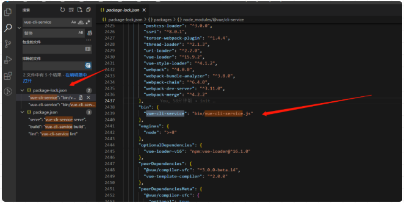

# npm run xxx的时候，发生了什么？
npm run xxx的时候，首先会去项目的package.json文件里找scripts 里找对应的xxx，然后执行 xxx的命令，
例如启动vue项目 npm run serve的时候，实际上就是执行了vue-cli-service serve 这条命令。

## package.json文件
```sh
{
  "name": "h5",
  "version": "1.0.7",
  "private": true,
  "scripts": {
    "serve": "vue-cli-service serve"
   },
}
```
## 为什么 不直接执行vue-cli-service serve而要执行npm run serve 呢？

因为 直接执行vue-cli-service serve，会报错，因为操作系统中没有存在vue-cli-service这一条指令


## 既然vue-cli-service 指令不存在操作系统中，为何执行npm run serve的时候，也相当于执行了vue-cli-service serve ，为什么这样它就能成功，而且不报指令不存在的错误呢？

在安装依赖的时候，是通过npm i xxx 来执行的，例如 npm i @vue/cli-service，npm 在 安装这个依赖的时候，就会在node_modules/.bin/ 目录中创建 好vue-cli-service 为名的几个可执行文件了。


.bin 目录，这个目录不是任何一个 npm 包。
目录下的文件，表示这是一个个软链接，打开文件可以看到文件顶部写着 #!/bin/sh ，表示这是一个脚本。

由此我们可以知道，当使用 npm run serve 执行 vue-cli-service serve 时，虽然没有安装 vue-cli-service的全局命令，但是 npm 会到 ./node_modules/.bin 中找到 vue-cli-service 文件作为  脚本来执行，则相当于执行了 ./node_modules/.bin/vue-cli-service serve（最后的 serve 作为参数传入）。

## .bin 目录下的文件表示软连接，那这个bin目录下的那些软连接文件是哪里来的呢？它又是怎么知道这条软连接是执行哪里的呢？

可以直接在新建的vue项目里面搜索vue-cli-service


可以看到，它存在项目最外层的「package-lock.json」文件中

从 package-lock.json 中可知，当我们npm i 整个新建的vue项目的时候，npm 将 bin/vue-cli-service.js 作为 bin 声明了。
所以在 npm install 时，npm 读到该配置后，就将该文件软链接到 ./node_modules/.bin 目录下，而 npm 还会自动把node_modules/.bin加入$PATH，这样就可以直接作为命令运行依赖程序和开发依赖程序，不用全局安装了。
假如我们在安装包时，使用 npm install -g xxx 来安装，那么会将其中的 bin 文件加入到全局，比如 create-react-app 和 vue-cli ，在全局安装后，就可以直接使用如 vue-cli projectName 这样的命令来创建项目了。

也就是说，npm i 的时候，npm 就帮我们把这种软连接配置好了，其实这种软连接相当于一种映射，执行npm run xxx 的时候，就会到 node_modules/bin中找对应的映射文件，然后再找到相应的js文件来执行。

## 看到在node_modules/bin中 有三个vue-cli-service文件。为什么会有三个文件呢？


如果我们在 cmd 里运行的时候，windows 一般是调用了 vue-cli-service.cmd，这个文件，这是 windows 下的批处理脚本：
```sh
@ECHO off
GOTO start
:find_dp0
SET dp0=%~dp0
EXIT /b
:start
SETLOCAL
CALL :find_dp0

IF EXIST "%dp0%\node.exe" (
  SET "_prog=%dp0%\node.exe"
) ELSE (
  SET "_prog=node"
  SET PATHEXT=%PATHEXT:;.JS;=;%
)

endLocal & goto #_undefined_# 2>NUL || title %COMSPEC% & "%_prog%"  "%dp0%\..\@vue\cli-service\bin\vue-cli-service.js" %*
```
所以当我们运行vue-cli-service serve这条命令的时候，就相当于运行 node_modules/.bin/vue-cli-service.cmd serve。
然后这个脚本会使用 node 去运行 vue-cli-service.js这个 js 文件
由于 node 中可以使用一系列系统相关的 api ，所以在这个 js 中可以做很多事情，例如读取并分析运行这条命令的目录下的文件，根据模板生成文件等。

# unix 系默认的可执行文件，必须输入完整文件名
```sh
vue-cli-service
```
# windows cmd 中默认的可执行文件，当我们不添加后缀名时，自动根据 pathext 查找文件
```sh
vue-cli-service.cmd
```
# Windows PowerShell 中可执行文件，可以跨平台
```sh
vue-cli-service.ps1
```
## 总结
运行 npm run xxx的时候，npm 会先在当前目录的 node_modules/.bin 查找要执行的程序，如果找到则运行；
没有找到则从全局的 node_modules/.bin 中查找，npm i -g xxx就是安装到到全局目录；
如果全局目录还是没找到，那么就从 path 环境变量中查找有没有其他同名的可执行程序。