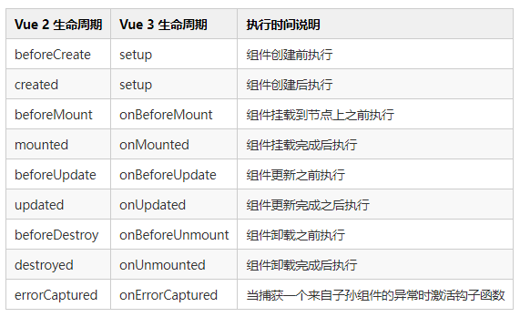

# Vue3 script setup 语法糖

# 组合式 API：setup()

Vue 3 的 Composition API 系列里，推出了一个全新的 setup 函数，它是一个组件选项，用于在组件创建之前执行一些初始化操作。setup() 函数在组件实例被创建之前执行，props 被解析之后执行，是组合式 API 的入口。因此它不能访问 this，因为此时组件实例还没有被创建。

setup 选项是一个接收 props 和 context 的函数。此外，我们将 setup 返回的所有内容都暴露给组件的其余部分 (计算属性、方法、生命周期钩子等等) 以及组件的模板。

Vue3中的三种写法：

1. 方式一：类似Vue2骨架，多了一个setup函数。
   
```sh
export default {
  props:[],
  setup(props,ctx) {
    const name = ref('张三');// 响应式数据
    const myMethods = ()=>{ // 自定义方法
    }
    return {
      name,
      myMethods,
    }
  },
}
```

2. 方式二：全新骨架，多了一个defineComponent。
   
```sh
export default defineComponent({
   props:[],
   setup(props,ctx) {
    ....
   },
})
```

3. 方式三：全新骨架，脚本文件script标签定义setup。

```sh
<script setup>
interface Props {
  name: string
}
// const { name, count = 100 } = defineProps<Props>(); // props方式一
const props = withDefaults(defineProps<Props>(), {  // props方式二
    name: 'hello',
})
const myMethods = ()=>{ // 自定义方法
}
</script>
```

```sh
<script>
// 这是一个基于 TypeScript 的 Vue 组件
import { defineComponent } from 'vue'

export default defineComponent({
  setup(props, context) {
    // 在这里声明数据，或者编写函数并在这里执行它

    return {
      // 需要给 `<template />` 用的数据或函数，在这里 `return` 出去
    }
  },
})

</script>
```
新的 setup 选项是在组件创建之前, props 被解析之后执行，是组合式 API 的入口。

在了解setup有什么作用之前，先在这里了解一下setup的执行时机：

```sh
import { defineComponent, onBeforeMount, onMounted } from 'vue'
export default {
  beforeCreate(){
    console.log('beforeCreate');
  },
  created(){
    console.log('created');
  },
  setup(props,ctx) {
    console.log('setup');
    onMounted(()=>{
      console.log('onMounted');
    })
  },
  mounted(){
    console.log('mounted')
  }
}
// setup
// beforeCreate
// created
// onMounted
// mounted
```
## 注意：

从上面代码我们可以看出，setup的执行时机是在生命周期beforeCreate和created之前的，我们都知道beforeCreate周期只是初始化Vue实例空对象（只有默认生命周期和事件，data、method等属性都未被初始化），created是组件实例已经完全创建，data、methods等属性已初始化，组件实例还没有挂载。考虑Vue3的执行时机，所以在`setup函数里this是毫无意义的`，this为undefined。Vue3去掉了这两个周期，setup内已经默认实现了这两个周期需要做的事情，Vue3新命名了周期（Vue2周期命名前添加on）以及封装生命周期为组合式api，方便开发者的使用：

在 setup 中你应该避免使用 this，因为它不会找到组件实例。setup 的调用发生在 data property、computed property 或 methods 被解析之前，所以它们无法>在 setup 中被获取。


在添加了setup的script标签中，我们不必声明和方法，这种写法会自动将所有顶级变量、函数，均会自动暴露给模板（template）使用，这里强调一句 “暴露给模板，跟暴露给外部不是一回事”

# 生命周期



可以看到 Vue 2 生命周期里的 beforeCreate 和 created ，在 Vue 3 里已被 setup 替代。

# script setup 语法糖

1. `<script setup>` 语法糖并不是新增的功能模块，它只是简化了以往的组合API（compositionApi）的必须返回（return）的写法，并且有更好的运行时性能。
2. 在 setup 函数中：所有 ES 模块导出都被认为是暴露给上下文的值，并包含在 ​​setup()​​ 返回对象中。相对于之前的写法，使用后，语法也变得更简单。

# 组件核心 API 的使用

## ref 

ref是最常用的一个响应式 API，它可以用来定义所有类型的数据，包括 Node 节点和组件。返回一个响应式对象，所有的值都通过 .value 属性获取。

```sh
<template>
    <div>{{counter}}</div>
</template>
<script setup >
import { ref } from 'vue'

const counter = ref(0);//不用 return ，直接在 templete 中使用

const timer = setInterval(() => {
    counter.value++
}, 1000)

onUnmounted(() => {
    clearInterval(timer);
})
</script>
```

## reactive

返回一个对象的响应式代理。
```sh
<script setup>
import { reactive, onUnmounted } from 'vue'

const state = reactive({
    counter: 0
})
// 定时器 每秒都会更新数据
const timer = setInterval(() => {
    state.counter++
}, 1000);

onUnmounted(() => {
    clearInterval(timer);
})
</script>
<template>
    <div>{{state.counter}}</div>
</template>
```

ref和reactive的关系:
ref是一个{value:'xxxx'}的结构，value是一个reactive对象。
reactive 的底层是 Proxy ，ref 的本质也是用 reactive 来包装，所以也是 Proxy，ref本质也是reactive

ref(obj)等价于reactive({value: obj})

## 组件自动注册

在 script setup 中，引入的组件可以直接使用，无需再通过components进行注册，并且无法指定当前组件的名字，它会自动以文件名为主，也就是不用再写name属性了。

```sh
<template>
	<Child />
</template>

<script setup>
import Child from '@/components/Child.vue'
</script>
```

## 定义组件的 props

efineProps ----> [用来接收父组件传来的 props] 代码示列：

通过defineProps指定当前 props 类型，获得上下文的props对象。

```sh

<script setup lang="ts"> 
import { defineProps } from 'vue';

const props = defineProps(["title"]);
</script>
<!-- 或者 -->
<script setup>
  import { defineProps } from 'vue';

  const props = defineProps({
    title: String, // 可以设置传来值的类型
  })
</script>
<!-- 或者 -->
<script setup>
  import { defineProps } from 'vue';

  const props = defineProps({
    // 可以设置传来值的类型和默认值
    title: {
        type:String,
        default: ''
    }
  })
</script>
<!-- 或者 -->
<script setup>
  import { defineProps } from 'vue';

  const props = defineProps({
    title: [String,Number] // 可以设置传来值的多种类型
  })
</script>
<!-- 或者 -->
<script setup lang="ts"> 
    import { ref,defineProps } from 'vue';
    
    type Props={ 
        title:string 
    }
    defineProps<Props>(); 
</script>

```

## 定义 emit

使用defineEmit定义当前组件含有的事件，并通过返回的上下文去执行 emit。示例：
```sh
<script setup>
  import { defineEmits } from 'vue'
  // 定义两个方法 change 和 delete
  const emit = defineEmits(['change', 'delete'])
  
  const handleClick=()=>{
    emit('change', 5); // 传给父组件的值的方法
  }
  
  const handleClickDel=()=>{
    emit('delete', 8); // 传给父组件的值的方法
  }
</script>

```

## 父子组件通信

1. 在Vue3中父子组件传值、方法是通过defineProps, defineEmits实现的。
2. defineProps 和 defineEmits 都是只在 <script setup> 中才能使用的。
3. 它们不需要导入就会随着 <script setup> 被一同处理编译。
4. defineProps 接收与 props 选项相同的值， defineEmits 也接收 emits 选项 相同的值。

defineProps 用来接收父组件传来的 props ; defineEmits 用来声明触发的事件。

```sh
//父组件
<template>
  <my-son foo="🚀🚀🚀🚀🚀🚀" @childClick="childClick" />
</template>

<script lang="ts" setup>
import MySon from "./MySon.vue";

let childClick = (e: any):void => {
  console.log('from son：',e);  //🚀🚀🚀🚀🚀🚀
};
</script>


//子组件
<template>
  <span @click="sonToFather">信息:{{ props.foo }}</span>
</template>

<script lang="ts" setup>
import { defineEmits, defineProps} from "vue";

const emit = defineEmits(["childClick"]);     // 声明触发事件 childClick
const props = defineProps({ foo: String });   // 获取props

const sonToFather = () =>{
    emit('childClick' , props.foo)
}
</script>

```
子组件通过 defineProps 接收父组件传过来的数据，子组件通过 defineEmits 定义事件发送信息给父组件

增强的props类型定义

```sh
const props = defineProps<{
  foo: string
  bar?: number
}>()

const emit = defineEmit<(e: 'update' | 'delete', id: number) => void>()
```

不过注意，采用这种方法将无法使用props默认值。

## 父组件调用子组件事件

defineExpose ----> [组件暴露出自己的属性]

传统的写法，我们可以在父组件中，通过 ref 实例的方式去访问子组件的内容，但在 script setup 中，该方法就不能用了，setup 相当于是一个闭包，除了内部的 template模板，谁都不能访问内部的数据和方法。

<script setup> 的组件默认不会对外部暴露任何内部声明的属性。
如果有部分属性要暴露出去，可以使用 defineExpose

```sh
<!-- 父组件 app.vue -->
<template>
  <div class="par">
    <!-- 使用 ref 指令关联子组件 -->
    <child ref="childRef"/>
    <button @click="handleClick">提交</button>
  </div>
</template>
<script setup>
import { reactive, ref } from "vue";
import child from "./child.vue";
//定义子组件实例，名称要和上面的ref相同
const childRef = ref(null);
 
//访问demo组件的方法或对象
const handleClick = () => {
  //获取到子组件的 title 数据 
  let title = childRef.value.state.title;
  //调用子组件的 play方法
  childRef.value.submit();
};
</script>
```


```sh
<!--子组件名称  child.vue -->
<template>
  <div class="child">
    {{ state.title }}
  </div>
</template>
<script setup>
import { ref, reactive } from "vue";
//定义一个变量
const state = reactive({
  title: "标题",
});
//定义一个方法
const submit = () => {
  state.title = "你调用了子组件的方法";
};
 
//暴露state和play方法
defineExpose({
  state,
  submit
});
</script>
```

