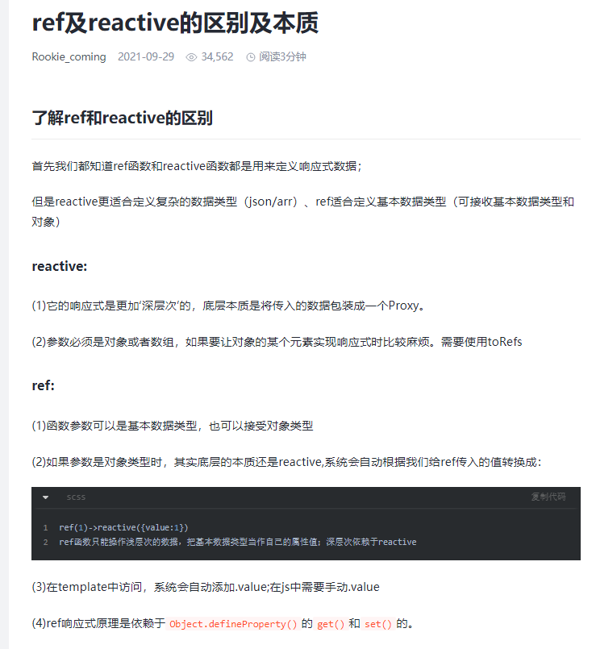

# ref和reactive的区别


# 原始类型差异

## ref
对于 ref 来说，原始类型和对象都可以对相应的数据做响应式处理，比如这种写法是可以的

```sh
const ref1 = ref(0);           // OK
const ref2 = ref({ count: 0 }) // OK
```

ref 可以处理原始类型的值，对于引用类型的值也不在话下，官方文档是这样解释的。如果给 ref 函数传递了一个对象，那么这个对象就会通过 reactive() 这个方法将其转换成具有深层次的响应式对象，也就是内部本质还是调用了 reactive 方法


## reactive
reactive 方法是不允许传递原始类型的值的，它并没有和 ref 一样检测到原始类型之后做对应的转换

```sh
const reactive1 = reactive(0);           // NOT OK
const reactive2 = reactive({ count: 0 }) // OK
```

reactive1 这种写法是不会报错的，你在页面也能够将这个值渲染出来，但是你是没有办法改变它的，也就失去了意义，对于 reactive 只能是对象最主要的原因在于在 vue 内部的响应式的实现，是依据 proxy 实现的，但是 proxy 不适用于基本类型数据

所以 ref 对于基本类型和引用类型都可以，但是 reactive 只适用于引用类型

# 数据访问方式不同

## ref

对于 ref 来说，无论是原始类型还是对象，访问数据都需要通过 .value 的形式进行，更新数据的话也是通过 .value 的形式

```sh
const ref1 = ref(0);
console.log(ref1.value); // 0

const ref2 = ref({ count: 0 })
console.log(ref2.value.count); // 0

ref1.value = 1
console.log(ref1.value); // 1
```

在 vue 的模版语法中，你大可不必带上 .value

```sh
<script setup>
import { ref } from 'vue'

const ref1 = ref(0)

</script>

<template>
  <div>{{ ref1 }}</div>
</template>
```

## reactive

由于是 proxy 代理的对象数据，你可以直接获取到数据，不必添加 .value

```sh
const reactive1 = reactive({ num: 0});
console.log(reactive1.num); // 0
```
更新和访问数据都可直接访问


# TS类型

## ref

ref 有一个特殊的属性 .value，所以对于它的类型，你可以直接从 vue 中导入，具体的写法这样

```sh
import { ref, Ref } from 'vue'
const ref1: Ref<number> = ref(0);
```
熟悉 ts 的话这个不陌生，不赘述了

## reactive

相对来说，reactive 的类型就比较简单了

```sh
import { reactive } from 'vue'
const reactive1: { num: number } = reactive({ num: 0});
```

传给 reactive 函数的对象类型是什么，就给返回值对应的什么类型即可

需要注意的一点是，如果这个对象当中包含 ref，这个时候 ref 是不需要添加对应的类型的，vue 会自动将其解包

```sh
import { reactive } from 'vue'
const reactive1: { num: number } = reactive({ num: ref(0)});
```
这种写法是没有问题的

# 监听方式区别

使用 watch 监听 ref 和 reactive 的方式是不同的

## ref

你可以直接监听 ref 的数据，类似这样，当 ref 的数据发生变化的时候，就会执行 watch 函数对应的回调

```sh
const ref1 = ref(0)
watch(ref1, () => { 
  console.log('changed!')
})
```

当然这里只是原始类型数据，前面提到过，ref 是可以传递对象的，如果是对象的话，还能够监听到么？

```sh
const ref1 = ref({num: 1})
watch(ref1, () => { 
  console.log('changed!')
})

// ref1.value.num = 1
```
当我执行 ref1.value.num = 2 时，会打印 changed! 么？

答案是不会的，因为 watch 并没有对 ref1 进行深度监听，但是要注意的是，这个时候 dom 是能够更新的，前面提到 ref 会将其转换成 reactive 的形式

要想深入监听，只需要加一个对应的参数即可

```sh
const ref1 = ref({num: 1})
watch(ref1, () => { 
  console.log('changed!')
}, { deep: true })
```

有了上述的基础，那对于 reactive 来说就简单了

## reactive

reactive 因为本质是对象，所以在 watch 的时候本能的会想添加 deep 属性，但是 vue 对其做了优化，使用 watch 监听 reactive 的时候可以不添加 deep 属性，也能够对其做深度监听

```sh
const reactive1 = reactive({num: 1})
watch(reactive1, () => { 
  console.log('changed!')
})

// reactive1.num = 1
```

上面的写法是能够实现我们想要的效果的

ref 和 reactive 本质我们可以简单地理解为ref是对reactive的二次包装， ref定义的数据访问的时候要多一个.value

1. 如果你需要一个响应式原始值，那么使用 ref() 是正确的选择，要注意是原始值
2. 如果你需要一个响应式对象，层级不深，那么使用 ref 也可以
3. 如果您需要一个响应式可变对象，并且对象层级较深，需要深度跟踪，那么使用 reactive


### 为什么似乎Proxy已经解决所有问题，还要有ref API呢？

因为ES的Proxy API是为引用数据类型服务的，它无法为基本数据类型提供代理。如果强行代理，Vue会有提示：value cannot be made reactive: 30。

### 那么为什么Vue2的defineproperty并没有区分基本数据类型和引用数据类型呢？

因为defineproperty就是Object的静态方法，它只是为对象服务的，甚至无法对数组服务，因此Vue 2弄了一个data根对象来存放基本数据类型，这样无论什么类型，都是根对象的property，所以也就能代理基本数据类型。

而Proxy能对所有引用类型代理，Vue 3也不再用data根对象，而是一个个的变量，所以带来了新问题，如何代理基本数据类型呢？并没有原生办法，只能构建一个{value: Proxy Object}结构的对象，这样Proxy也就能代理了。

## toRef是咋回事

先看看这个题目，看看Proxy对象里面的基本数据是否具备响应式：

```sh
<template>
<div>
  <button @click="r.a++"> button1-count is: {{ r.a }} </button>
  <button> button2-count is: {{ s }} </button>
</div>
</template>

<script>
import { reactive, toRef } from "vue";
export default {
  setup() {
    let r = reactive({a:1});
    console.log(r);
    let s = r.a;
    console.log(s);
    return {
      r,s
    };
  },
};
</script>
```

当我点击button1的时候，你说button2会变吗？并不会。变量s就是个基本数据，没有任何响应式。很不爽是不是？现在我改改，把let s = r.a;改成let s = toRef(r, 'a');，然后再试试？

可以看到button2的数字跟着变了！这就是toRef的作用：当一个变量指向一个对象的某个property，且这个property是基本数据类型时，必须用toRef才能将变量与对象的响应式连接。如果这个property是引用数据类型，就不需要动用toRef。

toRef的用途之一是用于传参，可传递一个响应式的基本数据类型。

toRef还有一个特点是可以提前绑定，看个例子，r的原始数据并没有property叫c，但是我就任性，我就提前让s赋值为toRef(r, 'c')，这时候两个button上是没有数据的，毕竟property c是不存在的，在我点击button1之后，两个button都显示了3，说明提前绑定是有用的。

```sh
<template>
<div>
  <button @click="r.c = 3">count is: {{ r.c }}</button>
  <button>count is: {{ s }}</button>
</div>
</template>

<script>
import { reactive, toRef } from "vue";
export default {
  setup() {
    let r = reactive({a:{b:2}});
    console.log(r);
    let s = toRef(r, 'c');
    console.log(s);
    return {
      r,s
    };
  },
};
</script>
```

## toRefs
toRefs是toRef的数组版，用于将响应式对象的所有property都转为ref，这样就可以在setup函数中直接使用。

toRefs 它可以将一个响应式对象转成普通对象，而这个普通对象的每个属性都是响应式的 ref。

```sh
<template>
    <div>
        {{ count.a }}
        {{ countAsRefs.a }}
        <button @click="addCount">+1</button>
    </div>
</template>

<script lang='ts' setup>
import { reactive, toRefs } from "vue"
const count = reactive({
    a: 1,
    b: 2
})
const countAsRefs = toRefs(count)
const addCount = () => {
    countAsRefs.a.value++
}

</script>
```

此时代码中的countAsRefs类型为
```javascript
{
  a: Ref<number>,
  b: Ref<number>
}
```
它的属性 a 和 b 都是响应式的 ref 对象，同样的它们和原对象的 count 的属性也是保持同步的。

根据它的特性我们通常用它来解构一个响应式对象而不会让其失去响应式。
```javascript
import { reactive, toRefs } from "vue";
const count = reactive({
  a: 1,
  b: 2,
});
const { a, b } = toRefs(count);
```

```javascript
// 展开运算符：
// 响应式对象的处理，是加给对象的，如果直接对对象做了展开操作，那么就会丢失响应式的效果。需要加上toRefs
<template>
　　<button @click="name='张三'">修改名字</button>{{name}}
</template>

<script lang='ts'>

import { reactive, toRefs } from 'vue'
export default {
　　setup() {
　　　　const user = reactive<any>({
　　　　　　name: '小明',
　　　　　　age: 10,
　　　　　　addr: {
　　　　　　　　province: '山东',
　　　　　　　　city: '青岛'
　　　　　　}
　　　　})
　　　　return {
　　　　　　...toRefs(user)
　　　　}
　　}
}
</script>
```

## isRef

isRef 用来判断一个值是否为一个 ref 对象

注意:它判断不了这个值是不是 reactive(可以使用 isReactive 判断)
```javascript
import { reactive, isRef, ref } from "vue";
const count = ref(1);
const testObj = reactive({
  a: 1,
});
console.log(isRef(count)); //true
console.log(isRef(testObj)); //false
```


## unref()
其实它是一个语法糖
```javascript
val = isRef(val) ? val.value : val;
```
如果是 ref 则返回它的内部值,否则则返回它本身。通过这个语法糖我们可以看出它可以对响应式对象解除响应式引用，比如我们只想获取一个响应式的值，但不想要它的响应式可以使用它解除引用。 例如
```javascript
<template>
    <div>
        {{ unRefAsCount }}
        {{ count }}
        <button @click="addCount">+1</button>
    </div>
</template>

<script lang='ts' setup>
import { unref, ref } from "vue"
const count = ref(1)
let unRefAsCount = unref(count)
const addCount = () => {
    count.value++
}
</script>
```
代码中的 unRefAsCount 是不具备响应式的。

## shallowRef

通过翻译我们可以看出它是浅层的 ref，什么是浅层的 ref 呢? 与 ref 不同的是只有.value 是响应式的，再深层的属性则不具备响应式。

```javascript
<template>
    <div>
        {{ shallowObj.a }}
        <button @click="addCount"> +1</button>
    </div>
</template>

<script lang='ts' setup>
import { shallowRef } from "vue"

const shallowObj = shallowRef({
    a: 1
})
const addCount = () => {
    //不会触发页面更新
    shallowObj.value.a++
}
</script>
```

但是如果我们将 addCount 改为修改整个.value 就会触发响应式了

```javascript
const addCount = () => {
  let temp = shallowObj.value.a;
  temp++;
  shallowObj.value = {
    a: temp,
  };
};
```

## customRef

customRef 用来创建一个自定义的 ref 对象

```javascript
import { customRef, ref } from "vue";

// 创建一个 ref 对象
const count = ref(0)

// 创建一个自定义的 ref 对象
const double = customRef((track, trigger) => {
  return {
    get() {
      track()
      return count.value
    },
    set(newValue) {
      track()
      count.value = newValue
      trigger()
    }
  }
})

// 修改 count 的值，会触发 double 的 set 方法
count.value++

// 读取 double 的值，会触发 double 的 get 方法
console.log(double.value)
```
)

###