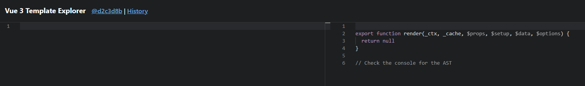
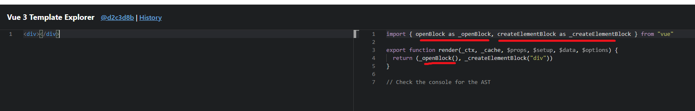
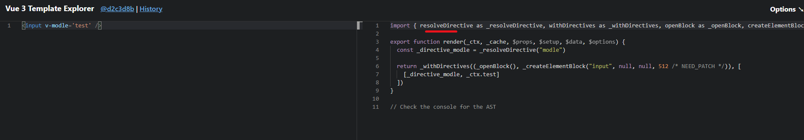
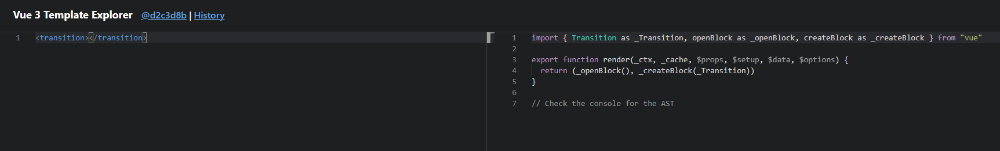

# tree shaking

中文（摇树），webpack构建优化中重要一环。摇树用于清除我们项目中的一些无用代码，它依赖于ES中的模块语法。Tree-shaking其实就是：把无用的模块进行“剪枝”，很多没有用到的API就不会打包到最后的包里。

比如日常使用lodash的时候

```sh
import _ from 'lodash'
```
如果如上引用lodash库，在构建包的时候是会把整个lodash包打入到我们的bundle包中的。


```sh
import _isEmpty from 'lodash/isEmpty';
```    

如果如上引用lodash库，在构建包的时候只会把isEmpty这个方法抽离出来再打入到我们的bundle包中。
这样的化就会大大减少我们包的size。所以在日常引用第三方库的时候，需要注意导入的方式。
如何开启摇树
在webpack4.x 中默认对tree-shaking进行了支持。

# vue3  tree shaking

vue3一个比较大的显著的区别就是，当你用一个bundler的时候，比如webpack或者rollup，webpack和rollup都是有tree shaking功能，但是tree shaking的前提是所有的东西都必须用ES6 module的import来写

而vue3 在浏览器里的时候依然会由一个全局的Vue对象，但是当你用了一个bundler时（比如webpack），它就没有default export，你就不能import xxx from vue，然后把vue本身当一个对象去操作。那所有的这些API全部要用import的方式import进来，这样的结果就是使得一些可能不会用到的一些功能就可以被tree shaking掉。比如说 v-model、<transition>这些功能，如果你不用的话，就不会引用到最后的包里。

Tree-shaking某种程度上来讲，也是通过编译器去实现的（记住这句话）。举例来说



可以看到，空的渲染函数没有从vue中引入任何东西

但是如果加入一个div



可以看见它引入一些东西，比如createVNode, openBlock, createBlock。这些东西只有当你引入东西的时候，这些东西才会被打包进去。
但默认的还是会保留一些最低的限制，比如Virtual DOM的更新算法以及响应式系统，无论如何这两个都是会包含在你得包里的。但是很多常用或者非常用的功能，只有当你用到时才会被import进来，比如v-model



可以看见，从vue中引入了vModelText, createVNode, withDirectives, openBlock, createBlock

再比如<transition>组件,用了<transition>，对应的Transition就会引入进来



所以没如果没用到，就不会引入进来。所以没有引入的东西最终就可以被tree shaking掉

所以，如果只写一个hello world，vue3的实际尺寸，即最终打包出来的整个应用的size，是13.5kb。如果去掉对2.0 option  API等的支持，最终打包出来是11.75kb。而所有的可选的运行时的东西全部一起加进来是22.5kb。这比现在vue2的整个尺寸还要小，而且还是在加了很多vue3的新功能的基础上

以上就是尤大对Tree-shaking的解析
之前让大家记住的一句话，为什么尤大说某种程度上来讲，Tree-shaking是通过编译器去实现的
其实说白了，Tree-shaking本质并不是Vue3的东西，而是那些打包工具的功能。只是Vue3代码结构调整，当用webpack等打包工具打包项目时，webpack会将那些没用用到的代码不打包到最后的项目中，这样使得项目体积更小
主要原理：依赖es6的模块化的语法，将无用的代码(dead-code)进行剔除!
。