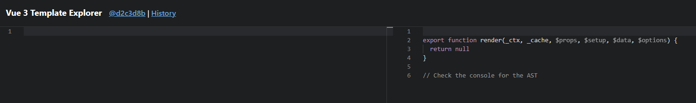
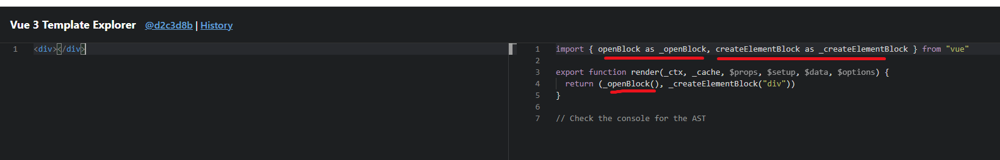
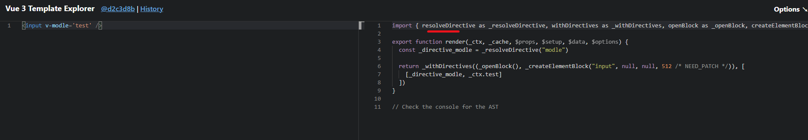
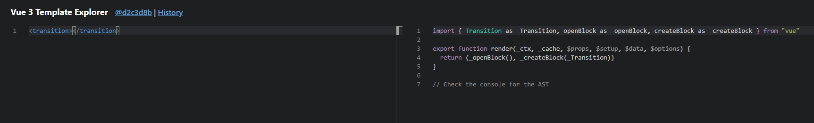

# tree shaking

Tree-Shaking这个概念在前端领域是因为rollup.js而起，后来webpack等也加入支持Tree-Shaking的行列中。
简单来说就是移除掉项目中永远不会被执行的代码（dead code），实际情况中，代码虽然依赖了某个模块，但其实只使用其中的某些功能。通过Tree-shaking，将没有使用的模块代码移除掉，这样来达到删除无用代码的目的。

Tree-shaking其实就是：把无用的模块进行“剪枝”，很多没有用到的API就不会打包到最后的包里。

比如日常使用lodash的时候

```sh
import _ from 'lodash'
```
如果如上引用lodash库，在构建包的时候是会把整个lodash包打入到我们的bundle包中的。


```sh
import _isEmpty from 'lodash/isEmpty';
```    

如果如上引用lodash库，在构建包的时候只会把isEmpty这个方法抽离出来再打入到我们的bundle包中。

这样就会大大减少我们包的size。所以在日常引用第三方库的时候，需要注意导入的方式。

如何开启摇树？

在webpack4.x 中默认对tree-shaking进行了支持。

# vue3  tree shaking

vue3一个比较大的显著的区别就是，当你用一个bundler的时候，比如webpack或者rollup，webpack和rollup都具有tree shaking功能，但是tree shaking的前提是所有的东西都必须用ES6 module的import来写

而vue3 在浏览器里的时候依然会有一个全局的Vue对象，但是当你用了一个bundler时（比如webpack），它就没有default export，你就不能import xxx from vue，然后把vue本身当一个对象去操作。那所有的这些API全部要用import的方式import进来，这样的结果就是使得一些可能不会用到的一些功能就可以被tree shaking掉。比如说 v-model、<transition>这些功能，如果你不用的话，就不会引用到最后的包里。

Tree-shaking某种程度上来讲，也是通过编译器去实现的（记住这句话）。

举例来说



可以看到，空的渲染函数没有从vue中引入任何东西

但是如果加入一个div



可以看见它引入一些东西，比如createVNode, openBlock, createBlock。这些东西只有当你引入东西的时候，这些东西才会被打包进去。
但默认的还是会保留一些最低的限制，比如Virtual DOM的更新算法以及响应式系统，无论如何这两个都是会包含在你的包里的。但是很多常用或者非常用的功能，只有当你用到时才会被import进来，比如v-model



可以看见，从vue中引入了vModelText, createVNode, withDirectives, openBlock, createBlock。

再比如`<transition>`组件，用了`<transition>`，对应的Transition就会引入进来。



所以如果没用到，就不会引入进来。所以没有引入的东西最终就可以被tree shaking掉

所以，如果只写一个hello world，vue3的实际尺寸，即最终打包出来的整个应用的size，是13.5kb。如果去掉对2.0 option  API等的支持，最终打包出来是11.75kb。而所有的可选的运行时的东西全部一起加进来是22.5kb。这比现在vue2的整个尺寸还要小，而且还是在加了很多vue3的新功能的基础上

以上就是尤大对Tree-shaking的解析

之前让大家记住的一句话，为什么尤大说某种程度上来讲，Tree-shaking是通过编译器去实现的。

其实说白了，Tree-shaking本质并不是Vue3的东西，而是那些打包工具的功能。只是Vue3代码结构调整，当用webpack等打包工具打包项目时，webpack会将那些没用用到的代码不打包到最后的项目中，这样使得项目体积更小。

主要原理：依赖es6的模块化的语法，将无用的代码(dead-code)进行剔除!


## 可以被Tree-shaking

有以下代码，其中工具函数文件中包含了foo与bar，在shaking文件中只使用了foo，在main文件中引用了foo，但没有使用：

```sh
// utils.js
export const foo = () => {
    console.log('foo')
}

export const bar = () => {
    console.log('bar')
}
// shaking.js
import { foo } from './utils.js'

const fn = () => {
    console.log('fn')
    foo()
}
fn()
// main.js
import { foo, bar } from './utils.js'

const main = () => {
    console.log('main')
    bar()
}
main()
```

现在分别使用rollup.js打包shaking.js与main.js文件。

```sh
# 打包shaking文件
npx rollup shaking.js -f esm -o bundle.js
# 打包main文件
npx rollup main.js -f esm -o mian-bundle.js
```

先来看shaking-bundle.js文件的内容，utils文件中foo打包进去，而bar没有被引用，则被移除。
```javascript
const foo = () => {
    console.log('foo');
};

const fn = () => {
    console.log('fn');
    foo();
};
fn();
```

再来看main-bundle.js文件的内容，utils文件中bar打包进去，而foo虽然被引用，但是没有在main.js文件中使用，则被移除。

```javascript
const bar = () => {
    console.log('bar');
};

const main = () => {
    console.log('main');
    bar();
};
main();
```

## 不可以被Tree-shaking

有些代码看着无用，但是确不能被Tree-shaking移除，例如我们对上面的代码进行重写

```javascript
// utils.js
// 新增以下代码
export default {
    name: function () {
        console.log('绝对零度')
    },
    age: () => {
        console.log(18)
    }
}
// shaking.js
import userInfo,  { foo } from './utils.js'

const fn = () => {
    console.log('fn')
    userInfo.name()
    foo()
}
fn()
```

再次使用rollup.js打包文件

```javascript
const foo = () => {
    console.log('foo');
};

var userInfo = {
    name: function () {
        console.log('绝对零度');
    },
    age: () => {
        console.log(18);
    }
};

const fn = () => {
    console.log('fn');
    userInfo.name();
    foo();
};
fn();
```
有意思的问题来了，这次我们仅仅使用name方法，而age方法也被打包进来，说明Tree-shaking没有生效。究其原因，export default导出的是一个对象，无法通过静态分析判断出一个对象的哪些变量未被使用，所以tree-shaking只对使用export导出的变量生效。

所以：
export default 对象被 import 后，挂在 default 上的属性和方法，即使没有被调用，也无法被 tree-shaking。
所以我们在组织模块文件时，应当尽可能避免 export default {A, B, C} 的写法

另外一个问题是，如果一个函数被调用的时候会产生副作用，那么就不会被移除。再次在utils文件中增加下面代码
```sh
// utils.js新增的代码
export const empty = () => {
    const a = 1
}

export const effect = (obj) => {
    obj && obj.a
}
```

再次导入使用然后打包

```sh
// shaking.js文件
import userInfo,  { foo, empty, effect } from './utils.js'

const fn = () => {
    console.log('fn')
    userInfo.name()
    empty()
    effect()
    foo()
}
fn()
```

打包后发现新增加了一个effect函数，而同时新增的empty函数被移除，分析原因发现effect函数就是一个纯读取函数，但是这个函数可能会产生副作用。试想一下，如果obj对象是一个通过Proxy创建的代理对象，那么当我们读取对象属性时，就会触发代理对象的get方法，在get方法中是可能产生副作用的，比如调用其它的方法或者修改一些变量等等。

```sh
const foo = () => {
    console.log('foo');
};
const effect = (obj) => {
    obj && obj.a;
};
var userInfo = {
    name: function () {
        console.log('绝对零度');
    },
    age: () => {
        console.log(18);
    }
};

const fn = () => {
    console.log('fn');
    userInfo.name();
    effect();
    foo();
};
fn();
```

由于rollup.js分析静态代码很困难，所以他们给我们提供一个机制，明确告诉rollup，这部分代码没有副作用可以移除。/*#__PURE__*/就是解决这个问题的办法，只需要在effect方法前面加上上面的代码，程序运行的时候就会认为他是没有副作用的，可以放心的进行Tree-shaking。

```sh
/*#__PURE__*/const effect = (obj) => {
    obj && obj.a;
};

```