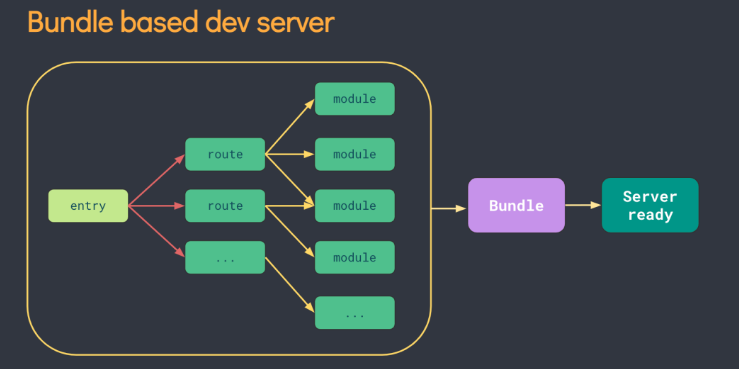

# vite和webpack区别

# 构建原理

## Webpack

Webpack 是一个静态模块打包器，通过对项目中的 JavaScript、CSS、图片等文件进行分析，生成对应的静态资源，并且可以通过一些插件和加载器来实现各种功能。Webpack 的主要特点是支持各种复杂的构建场景，例如代码分割、按需加载等，但也因此导致配置复杂，打包速度较慢。

### webpack打包过程

1. 识别入口文件

2. 通过逐层识别模块依赖。（Commonjs、amd或者es6的import，webpack都会对其进行分析。来获取代码的依赖）

3. webpack做的就是分析代码。转换代码，编译代码，输出代码

4. 最终形成打包后的代码

### webpack打包原理

1. 先逐级递归识别依赖，构建依赖图谱

2. 将代码转化成AST抽象语法树

3. 在AST阶段中去处理代码

4. 把AST抽象语法树变成浏览器可以识别的代码， 然后输出

## vite

Vite 则是一种基于浏览器原生 ES 模块解析的构建工具，它通过在服务器端搭建开发环境，在浏览器中使用原生 ES 模块的方式实现了快速的开发体验。Vite 的主要特点是支持快速的开发反应和打包速度快，但是在复杂的构建场景下可能会受到限制。

Vite 的主要功能就是通过劫持浏览器的这些请求，并在后端进行相应的处理将项目中使用的文件通过简单的分解与整合，然后再返回给浏览器，vite整个过程中没有对文件进行打包编译，所以其运行速度比原始的webpack开发编译速度快出许多！

# 构建速度

Vite 的构建速度比 Webpack 更快，因为 Vite 在开发环境中利用 ES module 的原生支持，无需预先编译全部代码，按需编译，不像 Webpack 一样使用打包后的文件进行模块加载。在 Vite 中，每个模块都可以独立地进行编译和缓存，这意味着它只需要重新编译修改过的模块，而不是整个应用程序。这使得 Vite 开发起来更加高效。

# vite热更新比webpack快

vite在HRM方面，当某个模块内容改变时，让浏览器去重新请求该模块即可，而不是像webpack重新将该模块的所有依赖重新编译

# 配置复杂度

Vite 的配置相对更简单，因为它无需进行大量的配置，只需指定一些基本的选项就可以开始开发。

Webpack 的配置更加复杂，需要针对具体项目进行不同的配置，且需要理解各种插件、Loader 等概念。

# 生态环境

Webpack 的生态环境更加成熟，在社区中拥有广泛的支持和丰富的插件库。

而 Vite 尚处于发展阶段，尽管其已经获得了很多关注，但其生态系统仍然不太完善。

# 功能特性

Webpack 是一个功能更加全面的打包工具，支持各种 Loader 和插件，可以处理多种类型的文件和资源。而 Vite 的设计初衷是专注于开发环境下的快速构建，因此其对一些高级特性的支持相对较少。

综上所述，Vite 更适合用于开发环境下的快速构建，而 Webpack 则更适合用于生产环境下的复杂应用程序的打包处理，选择使用哪种工具需要根据具体项目需求进行评估。