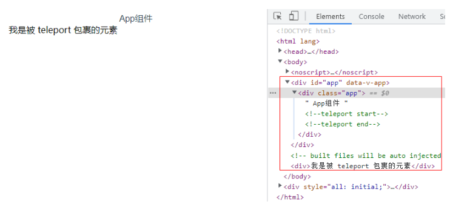

# Vue3中 内置组件 Teleport

Teleport 是一个内置组件，它可以将一个组件内部的一部分模板“传送”到该组件的 DOM 结构外层的位置去。

## 基础使用

1. 传送 DOM 节点

```sh
<template>
  <div class="app">
    App组件
    <Teleport to="body">
      <div>我是被 teleport 包裹的元素</div>
    </Teleport>
  </div>
</template>
```


从上图可以看出，Teleport 包裹的元素虽然是属于 app.vue 组件，但是渲染过后它却被渲染在了 body 这个 dom 元素下面了。
这都得归功于 Teleport 的传送功能，它的用法很简单，语法代码如下：
其中 to 就是“传送”的目的地了，即需要把包裹的内容传送到何处去。

<Teleport to="body">
</Teleport>

to 允许接收值：
期望接收一个 CSS 选择器字符串或者一个真实的 DOM 节点。

提示：
<Teleport> 挂载时，传送的 to 目标必须已经存在于 DOM 中。理想情况下，这应该是整个 Vue 应用 DOM 树外部的一个元素。
如果目标元素也是由 Vue 渲染的，你需要确保在挂载 <Teleport> 之前先挂载该元素。

2. 传送组件

< Teleport > 只改变了渲染的 DOM 结构，它不会影响组件间的逻辑关系。

也就是说，如果 < Teleport > 包含了一个组件，那么该组件始终和这个使用了 < teleport > 的组件保持逻辑上的父子关系。传入的 props 和触发的事件也会照常工作。
这也意味着来自父组件的注入也会按预期工作，子组件将在 Vue Devtools 中嵌套在父级组件下面，而不是放在实际内容移动到的地方。

3. 禁用传送功能

在某些场景下可能需要视情况禁用 < Teleport >，我们可以通过对 < Teleport > 动态地传入一个 disabled prop 来处理这两种不同情况（ disabled 属性接收一个 Boolean 值，true 代表不允许传送，false 代表传送）。
```sh
<template>
  <div class="app">
    app组件
    <Teleport to="body" :disabled="true">
      <p>我是被 teleport 包裹的元素</p>
      <p>{{ message }}</p>
    </Teleport>
  </div>
</template>

<script>
import { ref } from 'vue';
export default {
  setup(){
    const message = ref('我是在 App 组件内部');
    return {
      message,
    }
  } 
}
</script>
```

4. 多个元素传送给一个节点

多个 < Teleport > 组件可以将其内容挂载在同一个目标元素上，而顺序就是简单的顺次追加，后挂载的将排在目标元素下更后面的位置上。

```sh
<template>
  app组件
  <Teleport to="#customDom">
    <p>我是被 teleport 包裹的一号元素</p>
  </Teleport>
  <Teleport to="#customDom">
    <p>我是被 teleport 包裹的二号元素</p>
  </Teleport>
</template>
```


## 典型案例

我们使用 Vue 的 UI 组件库的时候，经常会用到模态框这个组件。如：使用 Element-plus 的模态框。

```sh
<template>
  <el-button @click="dialogVisible = true">打开弹窗</el-button>
  <el-dialog
    v-model="dialogVisible"
    append-to-body
    title="我是弹窗"
    width="30%">
  </el-dialog>
</template>

<script>
import { ref } from 'vue';
export default {
  setup(){
    const dialogVisible = ref(false);
    return {
      dialogVisible
    }
  } 
}
</script>
```

上段代码中在 App.vue 组件里面引用了 Element-plus 的弹窗组件，并且添加了一个 append-to-body 属性。


