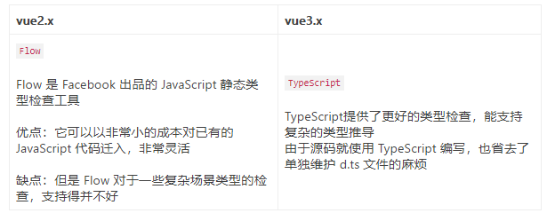

# vue3做了什么优化

## 一、Vue2存在的问题

1. 随着功能的增长，复杂组件的代码变得越来越难以维护；
2. 缺少一种比较“干净”的在多个组件之间提取和复用逻辑的机制；
3. 类型推断不够友好；
4. bundle的时间过久。

## 二、Vue3的优化

### Vue3的更小

Vue3移除一些不常用的API，引入tree-shaking，可以将无用模块“剪辑”，仅打包需要的，使打包的整体体积变小了。简单来说，treeshaking就是找出使用的代码。

Vue2中，无论使用什么功能，最终都会出现在生产代码中，主要原因是Vue实例在项目是单例的，捆绑程序无法检测到该对象的哪些属性在代码中被使用到。

```sh
import Vue from 'vue'
 
Vue.nextTick(() => {})
```

Vue3中引入tree shaking特性，将全局API进行分块，如果不使用某些功能，就不会出现在打包文件中。

```sh
import { nextTick, observable } from 'vue'
 
nextTick(() => {})
```

### Vue3的更快

1.  diff算法优化
   
vue3在diff算法中相比于vue2增加了静态标记，作用是为会发生变化的地方添加一个flag标记，下次发生变化的时候直接找该地方进行比较。比如下述例子：

```sh
<template>
    <div id="content">
        <p class="text">静态文本</p>
        <p class="text">静态文本</p>
        <p class="text">{{ message }}</p>
        <p class="text">静态文本</p>
        ...
        <p class="text">静态文本</p>
    </div>
</template>
```
这里的组件内部只有一个动态节点，剩余一堆都是静态节点，所以这里很多diff和遍历其实都是不需要的，会造成性能浪费。此时会给{{message}}标签标记一个flag=1，其他的静态文本会标记flag=-1，代表永远都不会进行diff操作。这样比较的时候可以直接选择flag=1的节点进行比较。

2.  静态提升
   
Vue3对于不参与更新的元素，会做静态提升，只会被创建一次，在渲染时直接复用，这样就可以免去了重复的创建节点。

下面举一个例子来展示一下静态提升的源码：

```sh
<span>你好</span>
<div>{{ message }}</div>
```

没有做静态提升之前：

```sh
export function render(_ctx, _cache, $props, $setup, $data, $options) {
  return (_openBlock(), _createBlock(_Fragment, null, [
    _createVNode("span", null, "你好"),
    _createVNode("div", null, _toDisplayString(_ctx.message), 1 /* TEXT */)
  ], 64 /* STABLE_FRAGMENT */))
}
```

做了静态提升之后:

```sh
const _hoisted_1 = /*#__PURE__*/_createVNode("span", null, "你好", -1 /* HOISTED */)

export function render(_ctx, _cache, $props, $setup, $data, $options) {
  return (_openBlock(), _createBlock(_Fragment, null, [
    _hoisted_1,
    _createVNode("div", null, _toDisplayString(_ctx.message), 1 /* TEXT */)
  ], 64 /* STABLE_FRAGMENT */))
}

// Check the console for the AST
```

静态内容_hoisted_1被放置在render 函数外，每次渲染的时候只要取 _hoisted_1 即可。
同时 _hoisted_1 被打上了 PatchFlag ，静态标记值为 -1 ，特殊标志是负整数表示永远不会用于 Diff。

3. 事件监听缓存（cacheHandler）

```sh
<div>
  <button @click = 'onClick'>点我</button>
</div>
```

默认情况下 @click 事件被认为是动态变量，所以每次更新视图的时候都会追踪它的变化。但是正常情况下，我们的 @click 事件在视图渲染前和渲染后，都是同一个事件，基本上不需要去追踪它的变化，所以 Vue 3.0 对此作出了相应的优化叫事件监听缓存，举个栗子：

没开启事件监听缓存之前：

在未开启事件监听缓存的情况下，我们看到这串代码编译后被静态标记为 8，之前讲解过被静态标记的标签就会被拉去做比较，而静态标记 8 对应的是“动态属性，不包括类名和样式”。

```sh
export const render = /*#__PURE__*/_withId(function render(_ctx, _cache, $props, $setup, $data, $options) {
  return (_openBlock(), _createBlock("div", null, [
    _createVNode("button", { onClick: _ctx.onClick }, "点我", 8 /* PROPS */, ["onClick"])
                                             // PROPS=1<<3,// 8 //动态属性，但不包含类名和样式
  ]))
})
```

开启事件监听缓存之后：

开启 cacheHandler之后，编译后的代码已经没有静态标记（PatchFlag），也就表明图中按钮不再被追踪比较变化，也就是说下次diff算法的时候直接使用，进而提升了 Vue 的性能。

```sh
export function render(_ctx, _cache, $props, $setup, $data, $options) {
  return (_openBlock(), _createBlock("div", null, [
    _createVNode("button", {
      onClick: _cache[1] || (_cache[1] = (...args) => (_ctx.onClick(...args)))
    }, "点我")
  ]))
}
```

4. SSR优化

当静态内容达到一定量级的时候，会用createStaticVNode方法在客户端去生成一个static node，这些静态node，会直接innerHtml，就不需要创建对象，然后根据对象渲染。

```sh
<div>
    <div>
        <span>你好</span>
    </div>
    ...  // 很多个静态属性
    <div>
        <span>{{ message }}</span>
    </div>
</div>
```

编译后

```sh
import { mergeProps as _mergeProps } from "vue"
import { ssrRenderAttrs as _ssrRenderAttrs, ssrInterpolate as _ssrInterpolate } from "@vue/server-renderer"

export function ssrRender(_ctx, _push, _parent, _attrs, $props, $setup, $data, $options) {
  const _cssVars = { style: { color: _ctx.color }}
  _push(`<div${
    _ssrRenderAttrs(_mergeProps(_attrs, _cssVars))
  }><div><span>你好</span>...<div><span>你好</span><div><span>${
    _ssrInterpolate(_ctx.message)
  }</span></div></div>`)
}
```

### Vue3的更友好

vue3的更友好体现在，兼顾vue2的options API的同时还推出了composition API，大大增加了代码的逻辑组织和代码的复用能力，同时优化了vue2中数据劫持，vue2中通过Object.defineProperty，这个API并不能检测对象属性的添加和删除，而Vue3通过proxy解决了这个问题。

1. Composition API
   
- Vue2中，代码是Options API风格的，也就是通过填充（option）data、methods、computed等属性来完成一个Vue组件。这种风格始得Vue容易上手，但是Options API不够灵活，组件间很难优雅的公用代码，并且Vue2的书写方式与JS的开发原则相悖，比如methods中的this竟然指向实例而不指向methods所在的对象。

- 在Vue3中，舍弃了Options API，开始使用Composition API。组件根据逻辑功能来组织的，一个功能所定义的所有 API 会放在一起（更加的高内聚，低耦合）。

2. proxy

- Object.defineProperty()方法会直接在一个对象上定义一个新属性，或者修改一个对象现有属性，并返回此对象。但是，如果存在深层的嵌套对象关系，需要深层次的进行监听，造成了性能的极大问题。

- Proxy的监听是针对一个对象的，那么对这个对象的所有操作会进入监听操作，这就完全可以代理所有属性，包括新增属性和删除属性，并且Proxy可以监听数组的变化。

- Proxy有多达13种拦截方法,不限于apply、ownKeys、deleteProperty、has等等，这是Object.defineProperty不具备的 。

- 正因为defineProperty自身的缺陷，导致Vue2在实现响应式过程需要实现其他的方法辅助（如重写数组方法、增加额外set、delete方法）
- 
### TS更友好


  
## 总结：Vue3对于Vue2有什么更新

Vue2在使用过程中，随着项目越来越复杂，项目代码维护起来也越来越困难，主要原因是Vue2使用的是Options API，这种方式把同一个功能的数据、方法、请求都分开写在data、methods等Options中。并且组件之间相同功能的复用也比较困难，同时响应式也没有那么灵活，因此，Vue3做出了如下的更新：

1. 用Composition API 代替 Options API，正如刚刚所说，Options API 将相同的功能的不同部分都分开写，不仅不利于阅读和维护，也和原生JS的思想相悖，缺乏灵活性，Vue3采用的Composition API按照功能将代码分割开，这样方便维护，也方便复用。

2. 采用Proxy 代替 Object.defineProperty，Vue2通过defineProperty的get、set和发布订阅来完成响应式，但是defineProperty的get、set并不能监控深层的对象与数组的变化，需要手动调用set来增加、删除响应式属性，还是造成了一些麻烦。Vue3采用Proxy监控整个对象，无论多深的属性都可以被监控到。

3. Vue3增加了tree shaking，能在打包的时候只打包用到的组件，可以让运行速度更快和打包文件更小

4. Vue3还改变了虚拟DOM的diff策略，在Vue2中，diff策略不会区别节点是静态节点还是动态节点，而对比过多的静态节点会造成资源的浪费。因此Vue3给每一个节点都打上了标签，如果标签不为-1，则证明是动态节点，在比较的时候也只需要比较动态节点，使diff算法的效率更高。

5. Vue3还增加了静态提升和事件监听缓存，将不需要重复创建的节点和方法单独提出、进行缓存，避免重复创建和加载。

6. Vue3还做了SSR优化。如果增加的静态内容过多，就会直接使用innerHTML的方法插入，而不会一个一个的创建的节点。
   
7. vue3还增加了TypeScript支持，让代码的类型检查更加方便。