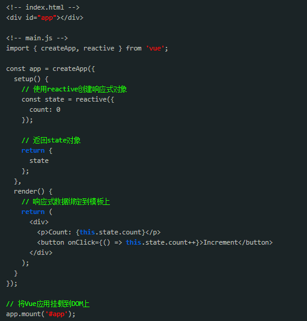

# Vue3相对于Vue2的改进：更高效的虚拟DOM

在Vue2中，虚拟DOM的更新机制是通过比较新旧虚拟DOM树的差异来实现的。然而，这种算法在处理大型应用程序时可能会导致性能问题，因为它需要对整个虚拟DOM树进行逐层的深度优先比较。

为了解决这个问题，Vue3引入了一种新的虚拟DOM算法，称为基于Proxy的虚拟DOM跟踪。这种新算法基于ES6的Proxy特性，通过跟踪响应式数据访问的方式，仅仅对实际被访问的数据进行依赖跟踪和更新。这种方式避免了遍历整个虚拟DOM树的性能开销，使得虚拟DOM的更新更加高效。

下面是一个简单的示例，展示了Vue3中基于Proxy的虚拟DOM跟踪的用法：

通过上述示例，我们可以看到，在Vue3中，我们使用了reactive函数来创建一个响应式的state对象。然后，我们可以在模板中直接引用state.count，并且当点击按钮时，state.count会自动更新并重新渲染。

需要注意的是，这里的state对象是一个代理对象，它仅仅追踪实际被模板访问的数据，而不会遍历整个逐层的深度优先比较虚拟DOM树。这种基于Proxy的跟踪机制使得Vue3在处理大型应用程序时更加高效。

综上所述，Vue3相对于Vue2带来了一个重要的改进，即更高效的虚拟DOM。通过基于Proxy的虚拟DOM跟踪机制，Vue3可以在处理大型应用程序时提供更好的性能表现。作为前端开发者，我们可以利用Vue3的新特性来优化我们的应用程序，提升用户体验。

在 Vue 3 中，引入了静态标记（Static Marking）来优化虚拟 DOM 的渲染过程。静态标记的目的是将静态节点（不会改变的节点）与动态节点（可能会改变的节点）进行区分，减少不必要的虚拟 DOM 对比和渲染操作，提高渲染性能。

静态标记在 Vue 3 编译器的阶段进行。编译器会根据模板的静态结构和动态绑定等信息，对模板中的节点进行静态标记。对于被标记为静态的节点，在后续的渲染过程中，会被视为不需要重新渲染的节点，从而避免不必要的计算和 DOM 操作。

在运行时，Vue 3 的虚拟 DOM 渲染器会根据静态标记的信息来确定需要更新的节点，从而优化渲染的过程。只有被标记为动态的节点才会进行重新渲染，而被标记为静态的节点不会触发重新渲染，从而提高渲染性能。

需要注意的是，静态标记是在编译阶段进行的，所以只有模板中的静态节点才能被正确地标记。如果使用了动态生成模板的方式（如通过字符串拼接），则无法进行静态标记的优化。

总结起来，静态标记是 Vue 3 中的一个编译器优化机制，通过识别静态节点和动态节点，并在渲染时跳过静态节点的更新，来提高渲染性能。

