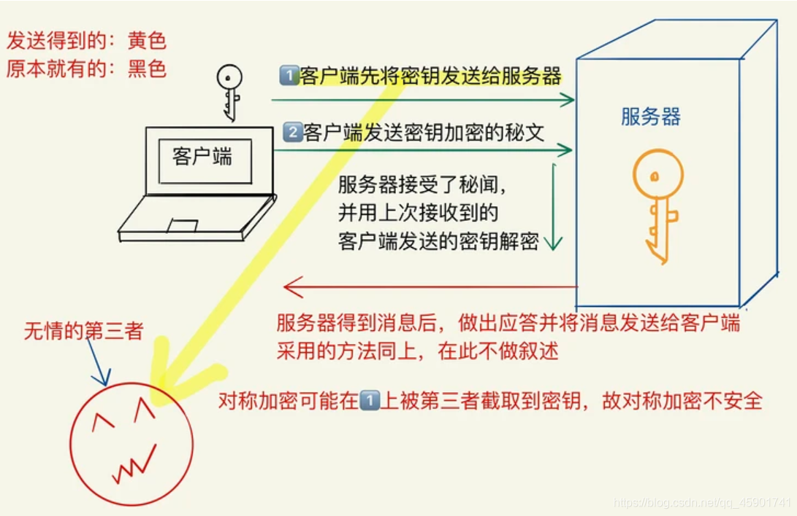
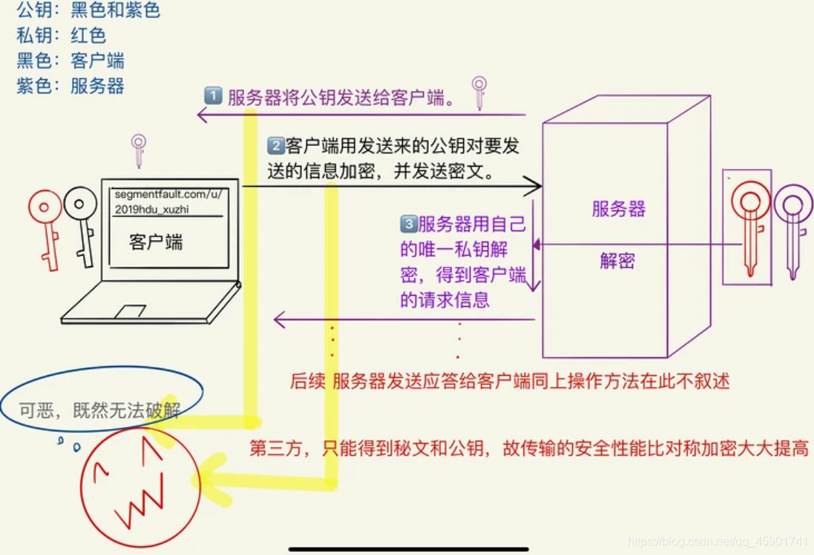
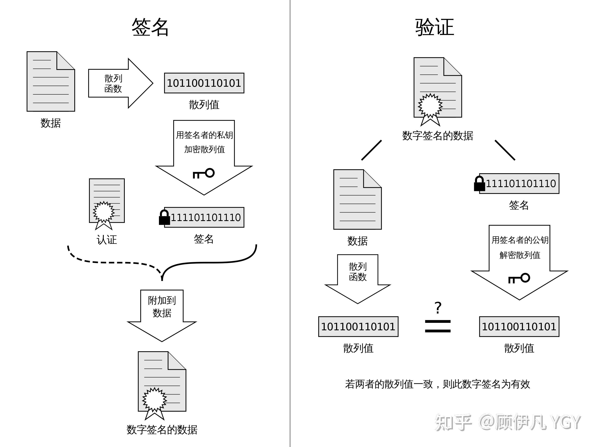
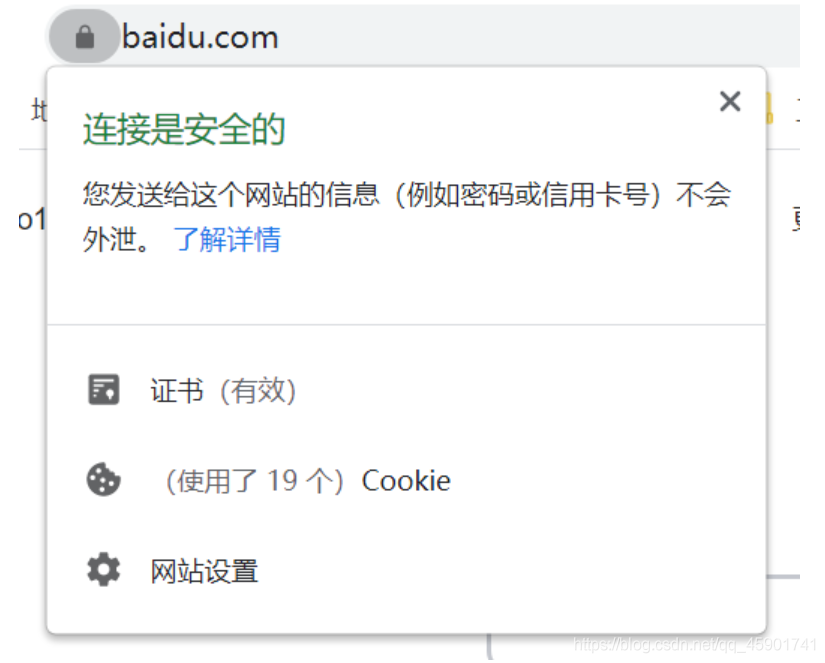

# 对称加密

## 定义
需要对加密和解密使用相同密钥的加密算法。所谓对称，就是采用这种加密方法的双方使用方式用同样的密钥进行加密和解密。密钥是控制加密及解密过程的指令。算法是一组规则，规定如何进行加密和解密。

## 密钥形式
采用单钥密码系统的加密方法，同一个密钥可以同时用作信息的加密和解密，这种加密方法称为对称加密，也称为单密钥加密

## 优缺点
优点：对称加密算法的优点是算法公开、计算量小、加密速度快、加密效率高。
缺点：对称加密，密钥管理的安全性很低，因为加密和解密都使用同一个密钥，在密钥的发送过程中，密钥可能被第三方截取，导致第三方也可以破解密文。

## 具体实现
在每次发送真实数据之前，客户端先生成一把密钥，然后先把密钥传输给服务端。之后客户端给服务端发送真实数据的时候，会用这把密钥对数据进行加密，服务端收到加密数据之后，用刚才收到的密钥进行解密。

# 非对称加密

## 定义
非对称加密算法需要两个密钥：公开密钥（publickey:简称公钥）和私有密钥（privatekey:简称私钥）。公钥与私钥是一对，如果用公钥对数据进行加密，只有用对应的私钥才能解密。因为加密和解密使用的是两个不同的密钥，所以这种算法叫作非对称加密算法。

## 密钥形式
公钥与私钥是一对。传输双方均有自己的一对密钥（也就是双方每方均有：公、私密钥一把，双方加起来共4把）

例子:传输双方比如是甲乙双方，甲方有配对的公、私密钥一对，且公钥负责加密，私钥负责解对应的公钥加的密。乙方同理。

## 优缺点
非对称密钥的算法强度复杂（是优点也是缺点），安全性依赖于算法与密钥。 
优点：安全性较高，比对称密钥安全性高很多。 非对称加密算法的保密性比较好，它消除了最终用户交换密钥的需要。 
缺点：由于其算法复杂，而使得加密解密速度没有对称加密解密的速度快。

## 具体实现
1. 客户端要向服务器发送信息，客户端和服务器都要产生一对用于加密和解密的公钥和私钥。 
2. 客户端的私钥保密，客户端的公钥告诉服务器；服务器的私钥保密，服务器的公钥告诉客户端。 
3. 客户端要给服务器发送信息时，客户端用服务器的公钥加密信息，因为服务器的公钥是公开的，客户端可以得到。 4. 客户端将这个消息发给服务器（已经用服务器的公钥加密消息）。
5. 服务器收到这个消息后，服务器用自己的私钥解密客户端的消息。其他所有收到这个报文的人都无法解密，因为只有服务器才有服务器的私钥。

# https的加密方式
上述的两种加密方式各有千秋，所以HTTPS作为最后出场的大佬，当然集大成者，采用的是处理信息的方式是：结合对称加密+非对称加密这两种方式，我们可以用非对称加密的方式来传输对称加密过程中的密钥，之后我们就可以采取对称加密的方式来传输数据了。

## 对称加密+非对称加密
服务器用明文的方式给客户端发送自己的公钥，客户端收到公钥之后，会生成一把密钥(对称加密用的)，然后用服务器的公钥对这把密钥进行加密，之后再把密钥传输给服务器，服务器收到之后进行解密，最后服务器就可以安全得到这把密钥了，而客户端也有同样一把密钥，他们就可以进行对称加密了。

但是，非对称加密的方式也并非万无一失，在此举个例子：

服务器以明文的方式给客户端传输公钥的时候，中间人截取了这把属于服务器的公钥，并且把中间人自己的公钥冒充服务器的公钥传输给了客户端。

之后客户端就会用中间人的公钥来加密自己生成的密钥。然后把被加密的密钥传输给服务器，这个时候中间人又把密钥给截取了，中间人用自己的私钥对这把被加密的密钥进行解密，解密后中间人就可以获得这把密钥了。

最后中间人再对这把密钥用刚才服务器的公钥进行加密，再发给服务器。

毫无疑问，在这个过程中，中间人获取了对称加密中的密钥，在之后服务器和客户端的对称加密传输中，这些加密的数据对中间人来说，和明文没啥区别。

## 证书
非对称性加密之所以不安全，是因为客户端不知道，这把公钥是不是服务器的。因此，我们需要找到一种策略来证明这把公钥就是服务器的，而不是别人冒充的，就像身份证一样，唯一标识我们服务器的公钥，解决这个问题的方式就是使用数字证书，具体是这样的：

而我们需要一个在互联网世界中充当公理的机构来签发这个证书，它就是CA机构，它是如今互联网世界正常运作的前提，而CA机构颁发的“身份证”就是数字证书：

网站在使用HTTPS前，需要向CA机构申领一份数字证书，数字证书里含有证书持有者信息、公钥信息等。服务器把证书传输给浏览器，浏览器从证书里获取公钥就行了，证书就如身份证，证明“该公钥对应该网站”。而这里又有一个显而易见的问题，“证书本身的传输过程中，如何防止被篡改”？即如何证明证书本身的真实性？身份证运用了一些防伪技术，而数字证书怎么防伪呢？解决这个问题我们就接近胜利了！

## 数字签名
有了数字整数之后，我们又，如何防止整数篡改呢？

我们把证书原本的内容生成一份“签名”，比对证书内容和签名是否一致就能判别是否被篡改。这就是数字证书的“防伪技术”，这里的“签名”就叫数字签名：

### 数字签名的制作过程：

1. CA机构拥有非对称加密的私钥和公钥。

2. CA机构对证书明文数据T进行hash。

3. 对hash后的值用私钥加密，得到数字签名S。

4. 明文和数字签名共同组成了数字证书，这样一份数字证书就可以颁发给网站了。

### 浏览器验证过程：

1. 拿到证书，得到明文T，签名S。

2. 用CA机构的公钥对S解密（由于是浏览器信任的机构，所以浏览器保有它的公钥。详情见下文），得到S’。

3. 用证书里指明的hash算法对明文T进行hash得到T’。

4. 显然通过以上步骤，T’应当等于S‘，除非明文或签名被篡改。所以此时比较S’是否等于T’，等于则表明证书可信。

这样的加密和验证方式的双重保险之下，基本就能保证我们的连接以及数据交互的安全，拥有这样证书和签名的网站我们访问起来有一把小锁的标识，说明我们的访问是安全的。

