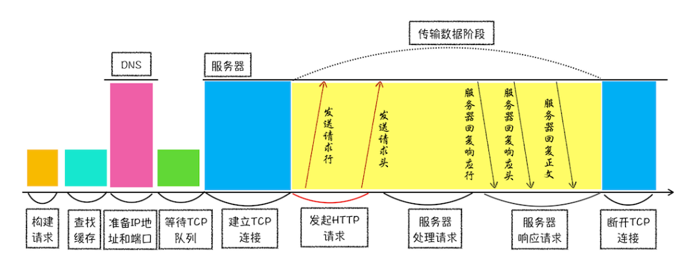
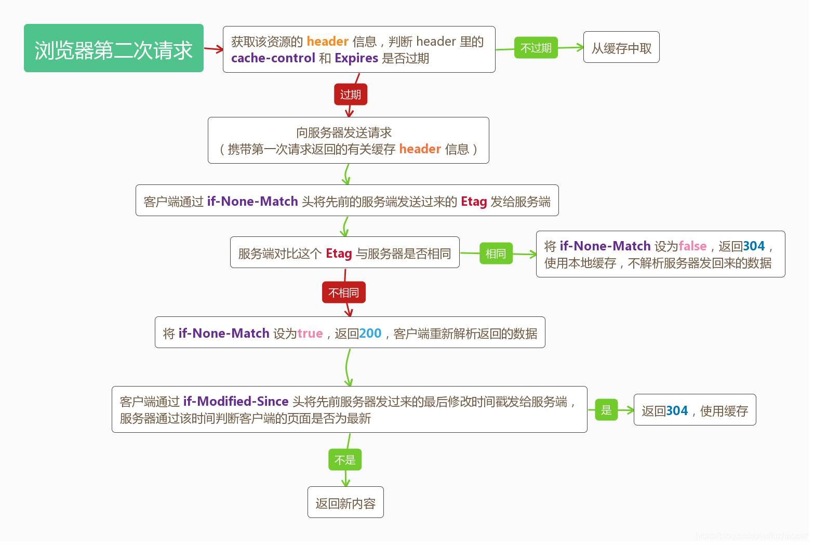
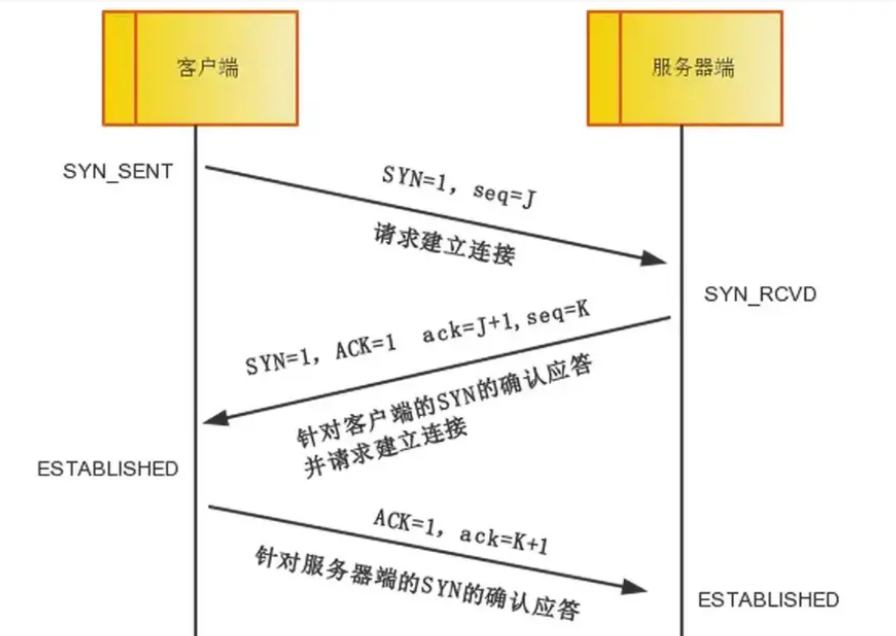
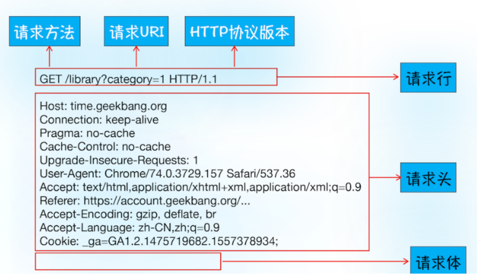
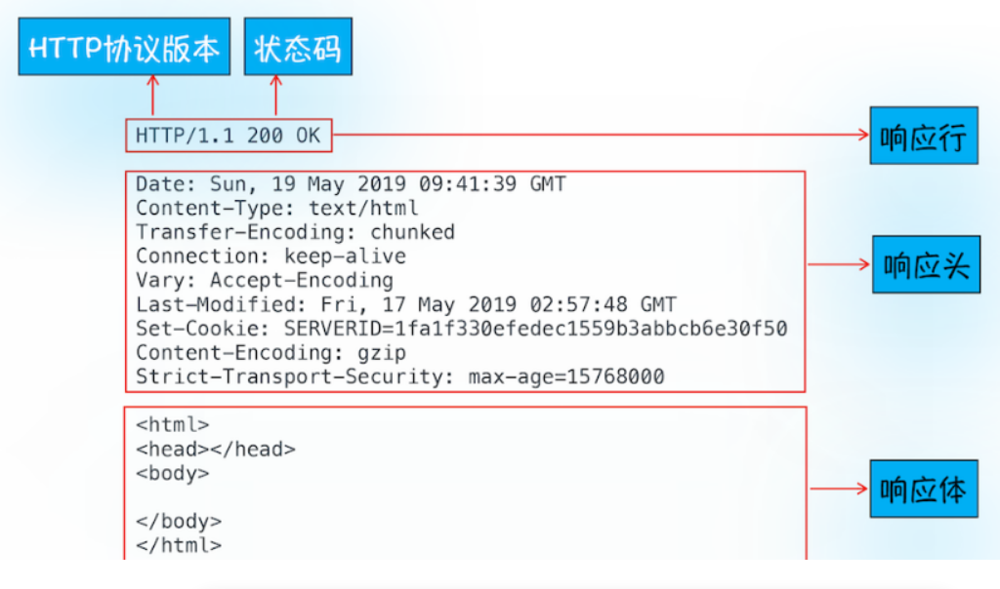

# 浏览器输入url到页面显示的过程

DNS解析寻址==>建立TCP连接 ==>发送HTTP请求 ==>服务器处理并回传 ==>浏览器接收并渲染 ==> 释放连接


## 一、DNS解析寻址 

通常我们在浏览器当中输入的URL（统一资源定位符）是域名，而不是直接输入ip（基本上指向计算机）地址。从宏观角度来讲，当我们输入URL并且提交的时候，第一步就是根与域名寻找目的服务器的ip地址，这个过程就是DNS域名解析。

### DNS解析过程

首先会从浏览器的缓存中去寻找是否有这个网址对应的IP地址，
如果没有就向OS系统的 DNS 缓存中寻找，
如果没有就是路由器的 DNS 缓存， 
如果没有就是 ISP 的DNS 缓存中寻找。 

所以，缓存的寻找过程就是：
浏览器 -> 系统 -> 路由器 -> ISP。 如果在某一个缓存中找到的话，就直接跳到下一步。
如果都没有找到的话，就会向 ISP或者公共的域名解析服务发起 DNS 查找请求。这个查找的过程还是一个递归查询的过程。

### 查找是否缓存

1）强缓存：通过Cache-Control和Expires来检查是否命中强缓存，命中则直接取本地磁盘的html（状态码为200
from disk(or memory) cache，内存or磁盘）；

2）协商缓存：如果没有命中强缓存，则会向服务器发起请求（先进行下一步的TCP连接），服务器通过Etag和Last-Modify来与服务器确认返回的响应是否被更改（协商缓存），若无更改则返回状态码（304
Not Modified）,浏览器取本地缓存；

3）若强缓存和协商缓存都没有命中则返回请求结果。

#### http 缓存

http 缓存从第二次开始。第一次请求从服务器加载所有资源，第二次请求浏览器根据响应头的字段加载缓存资源。

当服务器返回 HTTP 响应头给浏览器时，浏览器是通过响应头中的 Cache-Control 字段来设置是否缓存该资源。通常，我们还需要为这个资源设置一个缓存过期时长，而这个时长是通过 Cache-Control 中的 Max-age 参数来设置的。

因此在该缓存资源还未过期的情况下， 如果再次请求该资源，会直接返回缓存中的资源给浏览器。

如果缓存过期了，浏览器则会继续发起网络请求，并且在 HTTP 请求头中带上If-None-Match，服务器收到请求头后，会根据 If-None-Match 的值来判断请求的资源是否有更新。

如果没有更新，就返回 304 状态码，相当于服务器告诉浏览器，这个缓存可以继续使用。

如果资源有更新，服务器就直接返回最新资源给浏览器。


http缓存分为 强缓存 与 协商缓存。无论是命中哪个缓存资源都是从客户端本地加载，不同的是协商缓存会向服务器发起请求，强缓存不会向服务器发起请求。

https://zhuanlan.zhihu.com/p/397950806



## 二、与 WEB 服务器建立 TCP 连接

通过第一步拿到的ip地址，就能找到目标服务器，但是，在此之前需要建立传输通道，这个就是建立连接。这个过程就是著名的TCP三次握手。




Chrome 有个机制，同一个域名同时最多只能建立 6 个 TCP 连接，如果在同一个域名下同时有 10 个请求发生，那么其中 4 个请求会进入排队等待状态，直至进行中的请求完成。当然，如果当前请求数量少于 6，会直接进入下一步，建立 TCP 连接。

### 如果协议为https，则会对连接做加密处理

1）要先申请CA证书，并安装在服务器上（一个文件，配置nginx支持监听443端口开启ssl并设置证书路径）

2）浏览器发送请求；

3）网站从浏览器发过来的加密规则中选一组自身也支持的加密算法和hash算法，并向浏览器发送带有公钥的证书，当然证书还包含了很多信息，如网站地址、证书的颁发机构、过期时间等。

4）浏览器解析证书。

验证证书的合法性。如颁发机构是否合法、证书中的网站地址是否与访问的地址一致，若不合法，则浏览器提示证书不受信任，若合法，浏览器会显示一个小锁头。
或用户接受了不合法的证书，浏览器会生成一串随机数的密码（即密钥），并用证书中提供的公钥加密。
使用约定好的hash计算握手消息，并使用生成的随机数（即密钥）对消息进行加密，最后将之前生成的所有消息一并发送给网站服务器。

5）网站服务器解析消息。用已有的私钥将密钥解密出来，然后用密钥解密发过来的握手消息，并验证是否跟浏览器传过来的一致。然后再用密钥加密一段握手消息，发送给浏览器。

6）浏览器解密并计算握手消息的HASH，如果与服务端发来的HASH一致，此时握手过程结束，之后所有的通信数据将由之前浏览器生成的随机密码并利用对称加密算法进行加密。这里浏览器与网站互相发送加密的握手消息并验证，目的是为了保证双方都获得了一致的密码，并且可以正常的加密解密数据，为后续真正数据的传输做一次测试。

https://blog.csdn.net/qq_45901741/article/details/119223513

## 三、发送HTTP请求

建立连接后，双方可以开始传输数据了，首先在请求报文中必须明确请求的端口是哪个，还要确认端口，http默认80，然后浏览器向服务器发送请求，

从应用层开始，消息以HTTP请求报文的形式，在传输层，网络层，数据链路层逐层打上头部，进行传输。服务器接收到数据在逐层解套，最终收到HTTP协议的请求报文。

HTTP请求数据格式：



首先浏览器会向服务器发送请求行，它包括了请求方法、请求 URI（Uniform Resource Identifier）和 HTTP 版本协议。

其中，请求方式有GET，POST，PUT，Delete等，其中常用的POST会用于发送一些数据给服务器，比如登录网站把用户信息发送给服务器，一般这些数据会通过请求体发送。

在浏览器发送请求行命令之后，还要以请求头形式发送其他一些信息，把浏览器的一些基础信息告诉服务器。比如包含了浏览器所使用的操作系统、浏览器内核等信息，以及当前请求的域名信息、Cookie等。

## 四、服务器处理回传

服务端受到请求报文，就会根据请求报文提供的要求，比如端口，参数等等，去执行相应的操作，并将执行结果以响应报文的形式回传给服务器。如果请求的是静态资源直接回传，如果需要动态生成那么web服务器就会调用不同的程序来调用数据库生成最终的HTML文件，在回传给浏览器。



首先服务器会返回响应行，包括协议版本和状态码。

如果出现错误，服务器会通过响应行的状态码来返回对应的处理结果，例如：

最常用的状态码是 200，表示处理成功;

404，表示没有找到页面

500，表示服务器错误

正如浏览器会随同请求发送请求头一样，服务器也会随同响应向浏览器发送响应头。响应头包含了服务器自身的一些信息， 比如服务器生成返回数据的时间、返回的数据类型（JSON、HTML、流媒体等类型），以及服务器要在客户端保存的 Cookie 等信息。

响应头之后，服务器会发送响应体数据，通常包含了HTML的实际内容。以上为服务器响应浏览器的过程。


## 五、浏览器接收渲染

同样经过层层添加头部和去除投出，浏览器最终得到服务器返回的HTML数据，这个时候浏览器就在加载数据，根据内容开始渲染页面，数据加载完成就会触发onload事件。

浏览器会根据相应的内容来处理响应。如果响应可缓存，浏览器将把响应缓存。

需要注意的时候，第一次浏览器获得的是HTML文件，但是HTML文件如果继续有新资源的请求，那么就会建立新的连接，跟刚刚的过程一样。比如外部的css,js，图片等文件。


## 六、释放连接

TCP链接是无状态的，也就是一次性的，不会永久保存这个状态，所以双方完成一次数据的传输之后，如果没有持续的请求，那就要释放连接。

四次挥手断开连接。

不过如果浏览器或者服务器在其头信息中加入了：
```sh
Connection:Keep-Alive
```
则TCP 连接在发送后将仍然保持打开状态，这样浏览器就可以继续通过同一个 TCP 连接发送请求。保持 TCP 连接可以省去下次请求时需要建立连接的时间，提升资源加载速度。 如果一个页面内嵌的图片都来自同一web站点，则初始化一个持久连接则可复用减少TCP的连接。