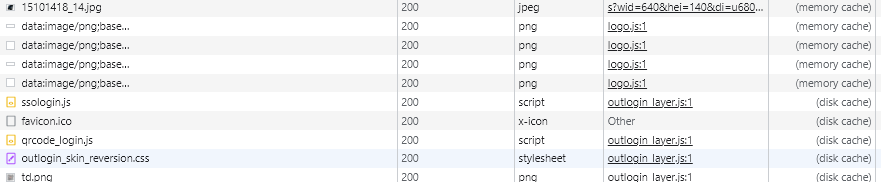
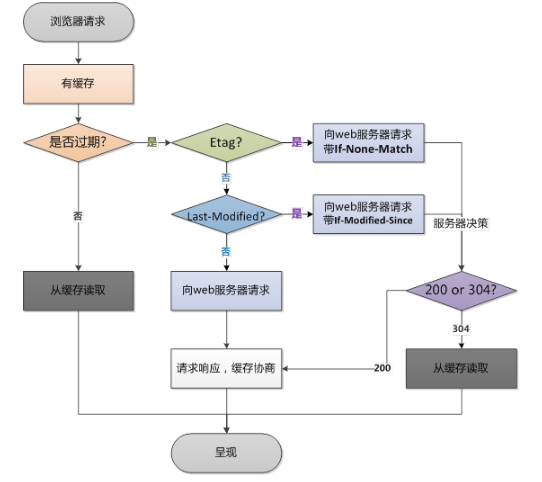

# 浏览器缓存的优点

1. 减少了冗余的数据传输，节省了网费
2. 减少了服务器的负担，大大提升了网站的性能
3. 加快了客户端加载网页的速度

# http缓存

1. 客户端向服务器发起请求时，会根据HTTP响应头的字段加载缓存的资源。
2. http 缓存从第二次开始。第一次请求从服务器加载所有资源，第二次请求浏览器根据响应头的字段加载缓存资源。
3. http 缓存分为 强缓存 与 协商缓存。无论是命中哪个缓存资源都是从客户端本地加载，不同的是协商缓存会向服务器发起请求，强缓存不会向服务器发起请求。

# 浏览器缓存：
1. 浏览器缓存分为：内存缓存(memory-cache)、硬盘缓存(disk-cache)

打开浏览器控制台，选择Network（网络），再刷新浏览器，我们就能看到请求资源详情：

一般频繁操作的文件都缓存在内存中，加载十分迅速。操作不频繁的文件就会缓存在硬盘中，加载速度也会较慢。
到底什么文件会缓存在内存中、什么会缓存在硬盘中，我们并不需要关心，让浏览器自己决定就行（其实也不清楚）。

# 强缓存（Cache-Control）：
强制缓存在客户端本地，请求直接从本地缓存中加载，不去请求服务器，返回的状态码是 200。强缓存需要 Cache-Control 字段， Cache-Control 是 HTTP 响应头中的字段。你可能在网上会看到有人会说还有 expires，pragma ，但都是 http1.0 的产物，现在应用最广泛的是 http1.1。所以我们减少一点学习压力，熟悉 Cache-Control 字段即可。
当我们向服务器请求资源时，服务器认为需要被缓存的资源比如（css，js文件 、图片），这些资源在响应头中都会默认携带 Cache-Control: public, max-age=0 。public, max-age=0 是默认值（相当于没有对资源缓存进行处理）。

## Cache-Control 属性值：
强缓存依赖 Cache-Control 字段，所以我们需要熟悉该字段的属性值，多个属性值用逗号隔开。
1. public           这些资源可以被任意对象缓存（如：客户端，代理服务器，等等）
2. private          这些资源只能在客户端缓存
3. max-age=xx       设置资源缓存的最大时间，超过时间表示缓存过期，请求会发到服务器（单位：秒）
4. no-cache         加载缓存资源前，强制发送请求到服务器进行“协商缓存”
5. no-store         不被做任何缓存
   

# 协商缓存（Etag）：
请求的资源通过资源标识与服务器协商比对，协商成功，服务器返回304状态码，浏览器从本地加载。
协商缓存需要用到 Etag 字段 与 if-none-match，Etag 是 HTTP 响应头中的字段，Etag 的值是根据资源内容编码生成的一段字符串（资源标识），内容不同就会生成不同的Etag。
你可能在网上看到还有 Last-modified ，了解即可。

再次发起请求时，请求头会带有 if-none-match 字段，值为上一次响应的 Etag（没有则不会携带）。服务器会将请求的资源生成资源标识与发送过来的值进行比对，如果比对成功则返回 304 状态码，浏览器从本地加载该资源。
如果协商失败服务器会返回新的资源+新的Etag（资源标识）。

## 为什么要有Etag
你可能会觉得使用Last-Modified已经足以让浏览器知道本地的缓存副本是否足够新，为什么还需要Etag呢？
HTTP1.1中Etag的出现主要是为了解决几个Last-Modified比较难解决的问题：

1. 一些文件也许会周期性的更改，但是他的内容并不改变(仅仅改变的修改时间)，这个时候我们并不希望客户端认为这个文件被修改了，而重新GET；
2. 某些文件修改非常频繁，比如在秒以下的时间内进行修改，(比方说1s内修改了N次)，If-Modified-Since能检查到的粒度是s级的，这种修改无法判断(或者说UNIX记录MTIME只能精确到秒)；
3. 某些服务器不能精确的得到文件的最后修改时间。
   
Last-Modified与ETag是可以一起使用的，服务器会优先验证ETag，一致的情况下，才会继续比对Last-Modified，最后才决定是否返回304。

## ETag和Last-Modified的作用和用法，他们的区别：

1. Etag要优于Last-Modified。
   Last-Modified的时间单位是秒，如果某个文件在1秒内改变了多次，那么他们的Last-Modified其实并没有体现出来修改，但是Etag每次都会改变确保了精度；
2. 在性能上，Etag要逊于Last-Modified，毕竟Last-Modified只需要记录时间，而Etag需要服务器通过算法来计算出一个hash值；
3. 在优先级上，服务器校验优先考虑Etag。

# 缓存过程

1. 浏览器第一次加载资源，服务器返回200，浏览器将资源文件从服务器上请求下载下来，并把response header及该请求的返回时间一并缓存；
   
2. 下一次加载资源时，先比较当前时间和上一次返回200时的时间差，如果没有超过cache-control设置的max-age，则没有过期，命中强缓存，不发请求直接从本地缓存读取该文件（如果浏览器不支持HTTP1.1，则用expires判断是否过期）；如果时间过期，则向服务器发送header带有If-None-Match和If-Modified-Since的请求
   
3. 客户端会通过If-None-Match头将先前服务器端发送过来的Etag发送给服务器，服务器收到请求后，优先根据Etag的值判断被请求的文件有没有做修改，Etag值一致则没有修改，命中协商缓存，If-None-Match的值设为false，返回304，客户端继续使用本地缓存，不解析服务器端发回来的数据；如果不一致则有改动，If-None-Match的值设为true，返回状态为200，客户端重新解析服务器端返回的数据；
   
4. 如果服务器收到的请求没有Etag值，则将If-Modified-Since和被请求文件的最后修改时间做比对，服务器端通过这个时间戳判断客户端的页面是否是最新的，如果不是最新的，则返回最新的内容，如果是最新的，则返回304，客户端继续使用本地缓存；

## 解决方案

1. 点击刷新按钮或者按F5
浏览器直接对本地的缓存文件过期，但是会带上If-Modifed-Since，If-None-Match,这就意味着服务器会对文件检查新鲜度，返回结果可能是304，也有可能是200.

2. 用户按Ctrl+F5（强制刷新）
浏览器不仅会对本地文件过期，而且不会带上 If-Modifed-Since，If-None-Match，相当于之前从来没有请求过，返回结果是200.

3. 地址栏回车
浏览器发起请求，按照正常流程，本地检查是否过期，然后服务器检查新鲜度，最后返回内容。