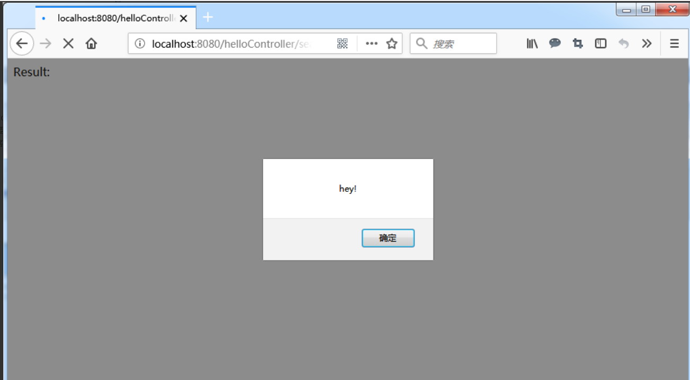
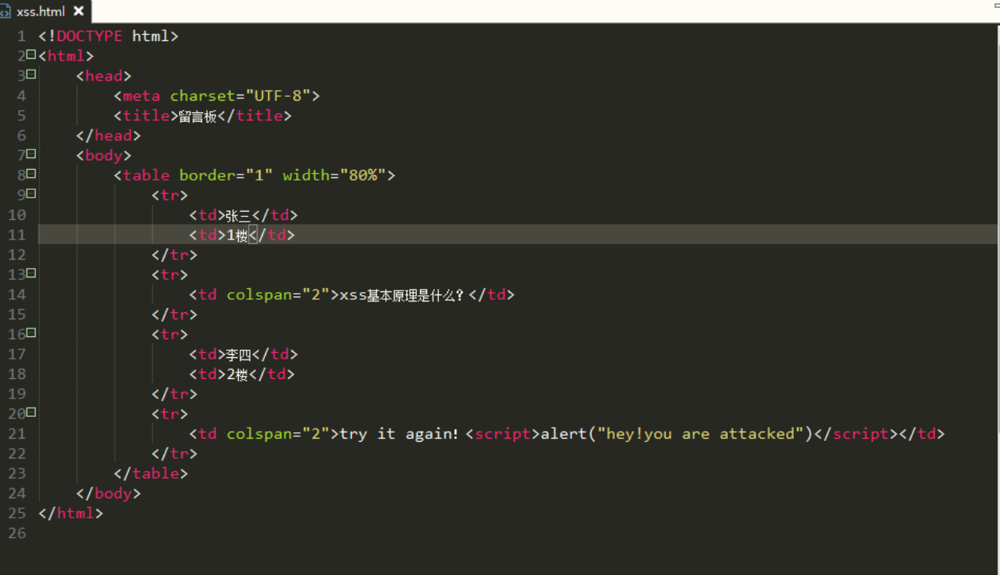
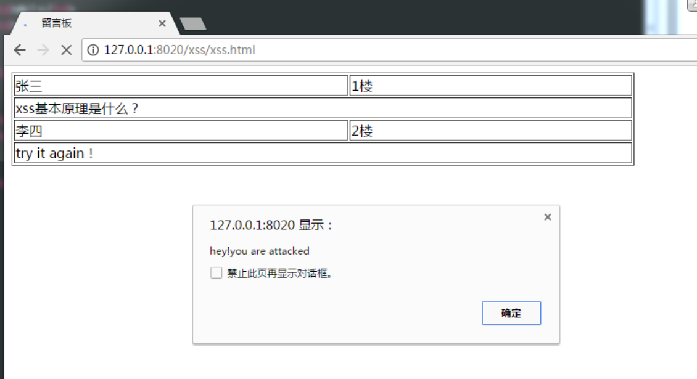
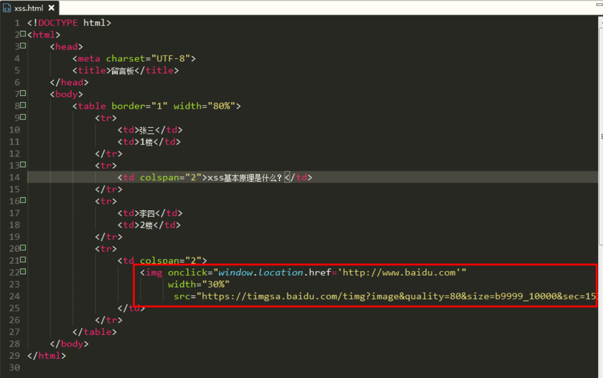
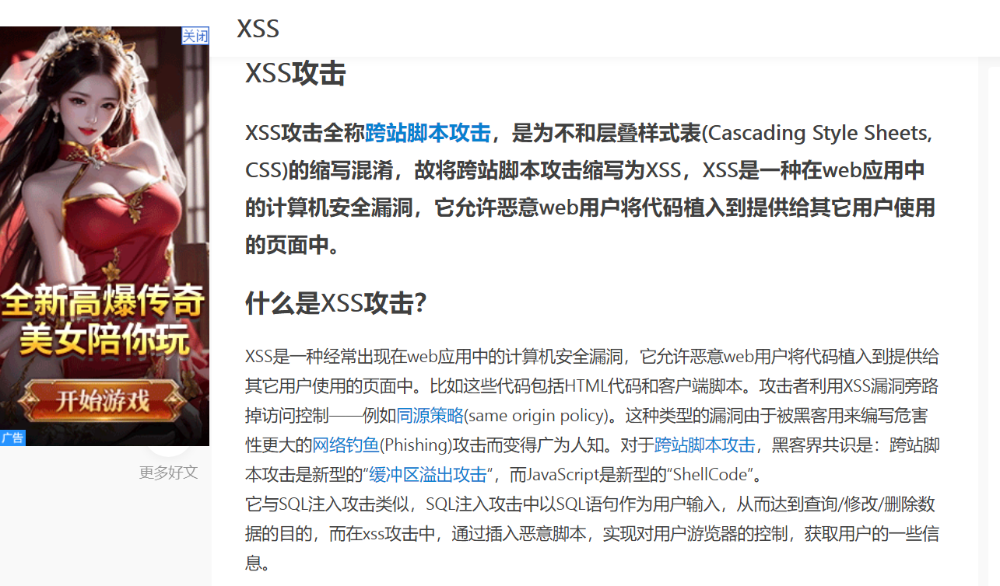
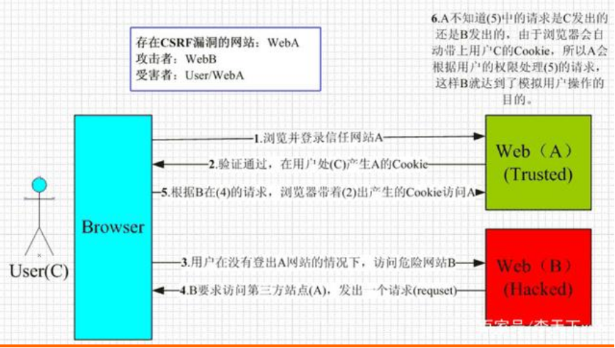

# 一、xss

## 基本概念

XSS（Cross Site Scripting）攻击全称跨站脚本攻击，是为不和层叠样式表(Cascading Style Sheets, CSS)的缩写混淆，故将跨站脚本攻击缩写为XSS，XSS是一种经常出现在web应用中的计算机安全漏洞，它允许恶意web用户将代码植入到提供给其它用户使用的页面中。比如这些代码包括HTML代码和客户端脚本。

## 攻击原理

XSS攻击的核心原理是：不需要你做任何的登录认证，它会通过合法的操作（比如在url中输入、在评论框中输入），向你的页面注入脚本（可能是js、hmtl代码块等）。
最后导致的结果可能是：
盗用Cookie破坏页面的正常结构，插入广告等恶意内容D-doss攻击

## 攻击方式

1. 反射型

反射型XSS，也叫非持久型XSS，是指发生请求时，XSS代码出现在请求URL中，作为参数提交到服务器，服务器解析并响应。响应结果中包含XSS代码，最后浏览器解析并执行。从概念上可以看出，反射型XSS代码是首先出现在URL中的，然后需要服务端解析，最后需要浏览器解析之后XSS代码才能够攻击。

　　这类通常使用URL，具体流程：

　　1)、Alice给Bob发送一个恶意构造了Web的URL。

　　2)、Bob点击并查看了这个URL。

　　3)、恶意页面中的JavaScript打开一个具有漏洞的HTML页面并将其安装在Bob电脑上。

　　4)、具有漏洞的HTML页面包含了在Bob电脑本地域执行的JavaScript。

　　5)、Alice的恶意脚本可以在Bob的电脑上执行Bob所持有的权限下的命令。

　　举个列子：
```sh
　　http://localhost:8080/helloController/search?name=<script>alert("hey!")</script>
　　http://localhost:8080/helloController/search?name=
　　http://localhost:8080/helloController/search?name=<a onclick='alert("hey!")'>点我</a>
```



2. 存储型

存储型XSS，也叫持久型XSS，主要是将XSS代码发送到服务器（不管是数据库、内存还是文件系统等），然后在下次请求页面的时候就不用带上XSS代码了。最典型的就是留言板XSS。用户提交了一条包含XSS代码的留言到数据库。当目标用户查询留言时，那些留言的内容会从服务器解析之后加载出来。浏览器发现有XSS代码，就当做正常的HTML和JS解析执行。XSS攻击就发生了。

常用来干嘛？

1)、窃取用户信息，如cookie，token，账号密码等。

例如：张三发了一篇帖子，李四进行回复：但内容却是一段js脚本，这篇帖子被他人浏览的时候就会中招，例子中的只是一个alert()，但脚本可以写的比较复杂一点盗用用户cookie等等操作。




2)、除了这种hacker还有个很惯用的伎俩，例如存储型XSS生成一些诱人的图片，文字（你懂的！），然后用户去点击的时候就可以执行某些坏事，窃取信息或者诱导到钓鱼网站。
```sh

```



点击图片后，就会进入到目标网站了。


3)、劫持流量实现恶意跳转

用户打开的网址，会默认跳转至指定网站，脚本如下：
```sh
　<script>window.location.href="http://www.baidu.com";</script>
```
## 防范手段
1. 入参字符过滤

在源头控制，把输入的一些不合法的东西都过滤掉，从而保证安全性。如移除用户提交的的DOM属性如onerror，移除用户上传的Style节点，`<iframe>, <script>，<a>`节点等

2. 出参进行编码

如果源头没控制好，就得后期补救了：像一些常见的符号，如<>在输出的时候要对其进行转换编码，这样做浏览器是不会对该标签进行解释执行的，同时也不影响显示效果。例如：对<>做编码如："<"用:"&lt;",">"用:"&gt;"来代替。

3. 入参长度限制

通过以上的案例我们不难发现xss攻击要能达成往往需要较长的字符串，因此对于一些可以预期的输入可以通过限制长度强制截断来进行防御。

4. 设置cookie httponly为true

其实就是现在HTTP协议（HTTPS也是可以的）才能读取cookies，JavaScript是读取不到cookies的。支持浏览器是IE6+、Firefox2+、Google、Safari4+。

JavaEE给Cookie添加HttpOnly的代码：
response.setHeader("Set-Cookie","cookiename=value; Path=/;Domain=domainvalue;Max-Age=seconds;HTTPOnly");

PS：对于HTTPS，还是可以设置Secure字段，对Cookie进行安全加密。
这本质上不是预防XSS，而是在被攻破时候不允许JS读取Cookie。
具体详情请参考：https://www.cnblogs.com/mao2080/p/9520185.html

# 二、CSRF

## 基本概念

CSRF（Cross Site Request Forgery），中文是跨站点请求伪造。CSRF攻击者在用户已经登录目标网站之后，诱使用户访问一个攻击页面，利用目标网站对用户的信任，以用户身份在攻击页面对目标网站发起伪造用户操作的请求，达到攻击目的。

## 攻击原理



用户是网站A的注册用户，且登录进去，于是网站A就给用户下发cookie。

从上图可以看出，要完成一次CSRF攻击，受害者必须满足两个必要的条件：

1. 登录受信任网站A，并在本地生成Cookie。（如果用户没有登录网站A，那么网站B在诱导的时候，请求网站A的api接口时，会提示你登录）
   
2. 在不登出A的情况下，访问危险网站B（其实是利用了网站A的漏洞）。

我们在讲CSRF时，一定要把上面的两点说清楚。
温馨提示一下，cookie保证了用户可以处于登录状态，但网站B其实拿不到 cookie。

## 防御手段

1. 尽量使用POST，限制GET

GET接口太容易被拿来做CSRF攻击，看第一个示例就知道，只要构造一个img标签，而img标签又是不能过滤的数据。接口最好限制为POST使用，GET则无效，降低攻击风险。
当然POST并不是万无一失，攻击者只要构造一个form就可以，但需要在第三方页面做，这样就增加暴露的可能性。

2. 浏览器Cookie策略

IE6、7、8、Safari会默认拦截第三方本地Cookie（Third-party Cookie）的发送。但是Firefox2、3、Opera、Chrome、Android等不会拦截，所以通过浏览器Cookie策略来防御CSRF攻击不靠谱，只能说是降低了风险。

PS：Cookie分为两种，Session Cookie（在浏览器关闭后，就会失效，保存到内存里），Third-party Cookie（即只有到了Exprie时间后才会失效的Cookie，这种Cookie会保存到本地）。

PS：另外如果网站返回HTTP头包含P3P Header，那么将允许浏览器发送第三方Cookie。

3. 加验证码

验证码，强制用户必须与应用进行交互，才能完成最终请求。在通常情况下，验证码能很好遏制CSRF攻击。但是出于用户体验考虑，网站不能给所有的操作都加上验证码。因此验证码只能作为一种辅助手段，不能作为主要解决方案。

4. Referer Check

Referer Check在Web最常见的应用就是“防止图片盗链”。同理，Referer Check也可以被用于检查请求是否来自合法的“源”（Referer值是否是指定页面，或者网站的域），如果都不是，那么就极可能是CSRF攻击。
但是因为服务器并不是什么时候都能取到Referer，所以也无法作为CSRF防御的主要手段。但是用Referer Check来监控CSRF攻击的发生，倒是一种可行的方法。

5. Anti CSRF Token

现在业界对CSRF的防御，一致的做法是使用一个Token（Anti CSRF Token）。
例子：

1). 用户访问某个表单页面。

2). 服务端生成一个Token，放在用户的Session中，或者浏览器的Cookie中。

3). 在页面表单附带上Token参数。

4). 用户提交请求后， 服务端验证表单中的Token是否与用户Session（或Cookies）中的Token一致，一致为合法请求，不是则非法请求。

这个Token的值必须是随机的，不可预测的。由于Token的存在，攻击者无法再构造一个带有合法Token的请求实施CSRF攻击。另外使用Token时应注意Token的保密性，尽量把敏感操作由GET改为POST，以form或AJAX形式提交，避免Token泄露。

注意：

CSRF的Token仅仅用于对抗CSRF攻击。当网站同时存在XSS漏洞时候，那这个方案也是空谈。所以XSS带来的问题，应该使用XSS的防御方案予以解决。


# 三、CSRF 和 XSS 的区别

区别一：

- CSRF：需要用户先登录网站A，获取 cookie。

- XSS：不需要登录。

区别二：（原理的区别）

- CSRF：是利用网站A本身的漏洞，去请求网站A的api。

- XSS：是向网站 A 注入 JS代码，然后执行 JS 里的代码，篡改网站A的内容。


# cookie 和 token 都存放在 header 里面，为什么只劫持前者？
因为 HTTP 协议是一个无状态的协议，但是服务器要区分到底是哪个用户发起的请求，就可以利用 cookie 来区分。每次请求都会发送 cookie，从而服务器就可以通过 cookie 来区分是哪个用户。但是 cookie 也有缺点，cookie 需要被存储在用户浏览器里面，如果 cookie 被拦截了，用户就可以被冒用了。因此，cookie 只适合用来识别用户。

而 token 存储在服务器，用户每次请求都会携带 token，所以服务器不需要再次查询数据库获取用户信息。另外，token可以避免 CSRF 攻击。

CSRF攻击的原因是浏览器会自动带上cookie，而不会带上token。

cookie：用户点击了链接，cookie未失效，导致发起请求后后端以为是用户正常操作，于是进行扣款操作；

token：用户点击链接，由于浏览器不会自动带上token，所以即使发了请求，后端的token验证不会通过，避免了CSRF 攻击。
